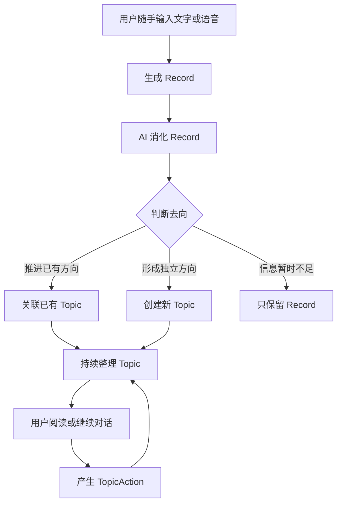
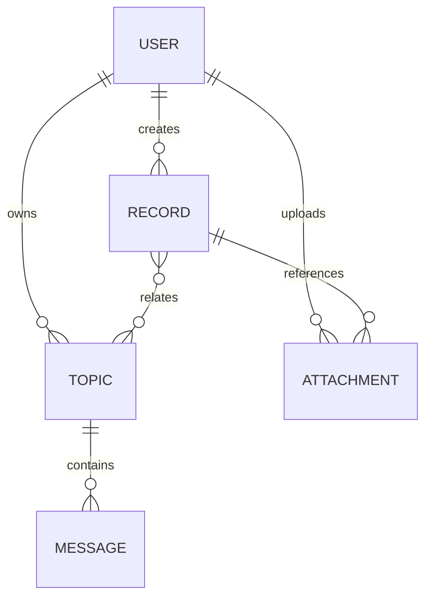
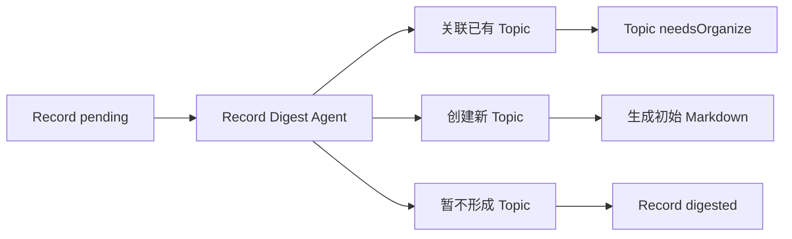
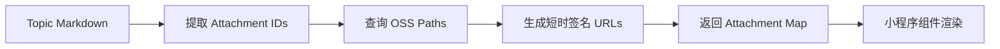
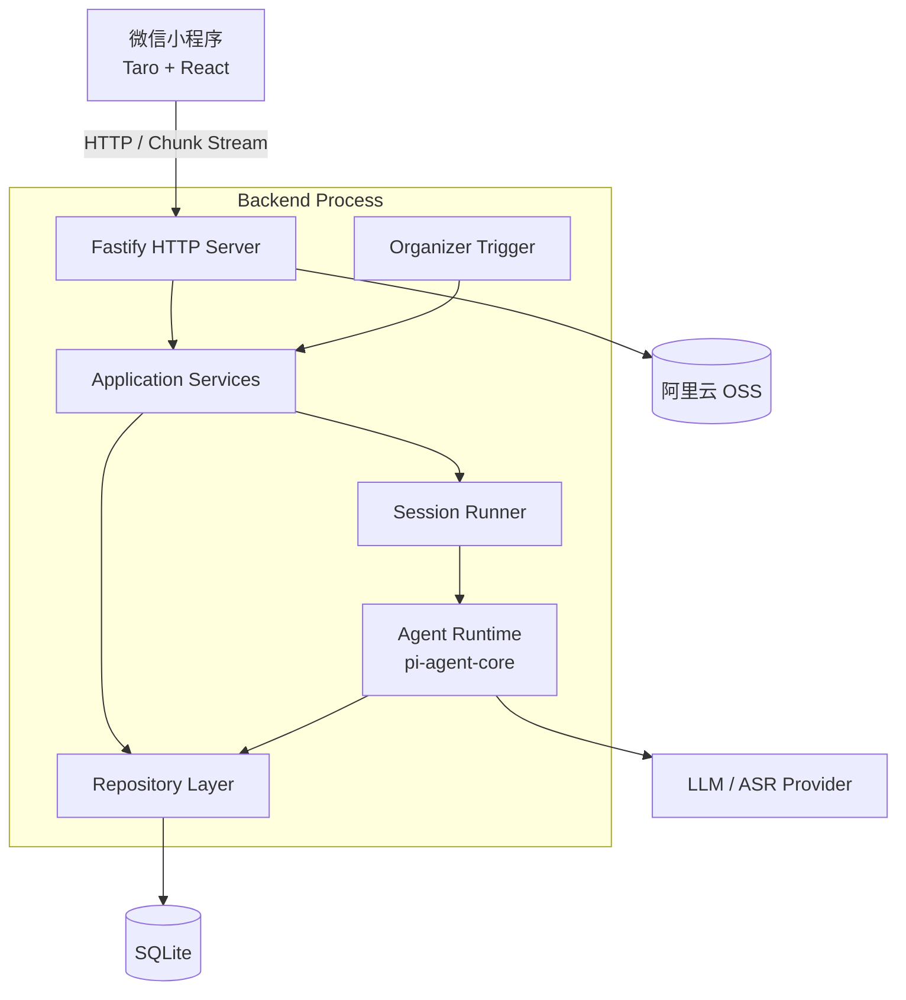
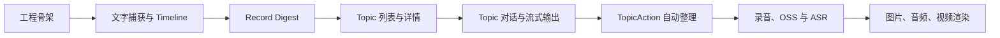

# AI 碎片思考助手

> 一个帮助用户随时捕获碎片想法，并由 AI 持续理解、关联和整理成长期话题的个人思考助手。

项目名称：Eiko

## 项目简介

工作、通勤和生活中经常会突然出现一些值得留下的内容：一个工作改进思路、一条职业判断、一个礼物灵感、一段情绪、一次带娃后的反思，或者对兴趣领域的新见解。

传统记事工具能够保存这些内容，却很难继续处理它们：

- 输入入口分散，记录成本高；
- 碎片内容缺少上下文，难以归类；
- 有价值和没价值的内容混在一起；
- 即使记录下来，也容易随着时间被遗忘；
- 用户很少有时间主动回顾、关联和深入研究。

本产品不要求用户先整理，而是将过程拆成两部分：

1. 用户负责尽可能自然地留下真实表达；
2. AI 在后台持续理解记录，将相关内容连接成能够生长的 Topic，并在需要时陪用户继续讨论。

产品追求的不是“更智能的便签分类”，而是让零散表达逐渐产生结论、行动、理解和情绪价值。

## 产品原则

- **捕获优先：** 输入时不要求选择分类、标签或处理方式。
- **原文保留：** AI 不覆盖用户真实写下或说过的内容。
- **结论优先：** Topic 先呈现实质性的判断、想法和帮助，而不是解释 AI 做了什么。
- **关系自然生长：** Record 可以暂不属于任何 Topic，也可以关联多个 Topic。
- **保守整理：** 错误合并比暂时不合并更糟；不确定时先保留 Record。
- **对话与记忆分离：** Topic 对话不会自动成为相关记忆。
- **后台无感运行：** 自动整理不向用户承诺固定心跳时间，也不暴露复杂任务状态。
- **用户保持控制：** AI 可以提出新的理解，但不能悄悄改变用户的原始表达。

## MVP 形态

MVP 优先以微信小程序验证，保留三个主页面和一个详情交互层：

| 页面 | 作用 | P0 能力 |
|---|---|---|
| Inbox | 极简捕获入口 | 快速文字、语音录制、关键时刻标记 |
| 记录 | 用户原始输入 Timeline | 原文、附件、整理状态、关联 Topic |
| 话题 | AI 形成的长期思考方向 | 标题、直接结论、摘要、更新时间 |
| 话题详情 | 阅读与继续思考 | 相关记忆、Markdown 正文、底部对话入口 |
| 对话 Sheet | 围绕 Topic 继续沟通 | 文字、ASR 后手动发送、流式 AI 回复 |

MVP 暂不包含：

- “我的”页面；
- 回顾次数、连续记录等统计；
- 强制内容分类；
- Topic 下的调研任务和复杂 Agent 工作流；
- 向量数据库；
- 多实例和分布式任务队列；
- 独立 Agent 服务；
- 自动将对话内容写入 Record。

## 核心体验



### Inbox

Inbox 必须保持纯粹：

- 页面中央是语音主按钮；
- 页面底部是快速文字输入；
- 不出现分类、标签和复杂快捷操作；
- 用户提交后立即生成 Record；
- AI 是否已经处理，不影响继续记录。

### 记录

Record 是用户真实留下的一次表达：

- `content` 保存文本；
- `attachmentIds` 保存图片、音频、视频等附件；
- `topicIds` 表示关联的零到多个 Topic；
- `digestStatus` 表示后台是否已经理解和处理。

Timeline 只展示 Record，不混入 AI 对话消息。

### 话题

Topic 是若干相关 Record 逐渐形成的持续思考方向，对应用户看到的“回声”。

Topic 页面首先提供：

- 直接结论；
- 新的想法；
- 可能的行动；
- 决策辅助；
- 必要的情绪理解和安抚。

Topic 正文使用 Markdown，可逐步扩展图片、音频、视频和普通外部链接。

### 相关记忆

Topic 详情顶部展示关联 Records：

- 默认展开；
- 默认高度约为两条记录；
- 内部可以继续滚动；
- 支持收起；
- 始终展示用户的原始内容；
- Topic 对话不会自动进入这里。

### Topic 对话

点击 Topic 底部输入入口后，从底部弹出对话 Sheet：

- 用户可以补充想法、提出问题或纠正 AI；
- 支持普通文字；
- 支持录音转文字；
- ASR 结果必须由用户确认并手动发送；
- AI 回复流式展示；
- 对话产生的新理解通过 TopicAction 等待下一次整理。

## 领域模型

MVP 只保留两个核心领域和三个支撑对象。



### Record

```ts
type Record = {
  id: string
  userId: string

  source: 'home'
  content: string
  attachmentIds: string[]
  topicIds: string[]

  digestStatus: 'pending' | 'processing' | 'digested'
  digestResult?: RecordDigestResult
  digestVersion?: string

  occurredAt: string
  createdAt: string
  updatedAt: string
}
```

设计约束：

- P0 的 `source` 固定为 `home`；
- `content` 必须存在，但录音转写完成前允许为空字符串；
- Record 最多自动关联两个 Topic；
- `digested` 表示 AI 已经判断过，不表示一定属于某个 Topic；
- `digestResult` 保存模型的完整判断和理由，便于后续优化。

### Topic

```ts
type Topic = {
  id: string
  userId: string
  sessionId: string

  title: string
  summary: string
  bodyMarkdown: string

  tags: string[]
  matchText: string

  pendingActions: TopicAction[]
  needsOrganize: boolean

  status: 'active' | 'archived'
  createdAt: string
  updatedAt: string
}
```

- `tags` 是候选筛选的辅助信息，不是强制分类。
- `matchText` 描述 Topic 的范围、当前问题和排除边界。
- `pendingActions` 保存多轮对话产生的整理指令。
- `needsOrganize` 是后台扫描字段。
- P0 不保存 Topic 版本历史。

### TopicAction

```ts
type TopicAction = {
  id: string
  type: 'merge_insight' | 'correct' | 'reorganize'
  content: string
  createdAt: string
}
```

TopicAction 不是用户任务，也不单独建表：

- `merge_insight`：吸收本轮新增结论或行动建议；
- `correct`：修正 Topic 中已有理解；
- `reorganize`：阶段性总结或重新组织正文。

### Message

Message 保存 Pi Agent 原始消息事件：

```ts
type Message = {
  id: number
  userId: string
  topicId: string
  sessionId: string
  role: 'user' | 'assistant' | 'toolResult'
  payload: string
  timestamp: number
}
```

`payload` 保存完整 Pi 消息 JSON，不再拆分 content、toolCalls、usage 等字段。

### Attachment

```ts
type Attachment = {
  id: string
  userId: string

  ossPath: string
  fileName: string
  extension: string
  mimeType: string
  size: number

  mediaType: 'image' | 'audio' | 'video' | 'file'
  durationMs?: number
  width?: number
  height?: number

  status: 'uploading' | 'ready' | 'deleted'
  createdAt: string
}
```

## Record 自动消化

Record Digest 是 MVP 的核心 AI 逻辑。

每条新 Record 必须产生以下决策之一：

```text
link_existing：关联已有 Topic
create_new：创建新 Topic
no_topic：暂时只保留 Record
```

### 相关性判断

Record 只有在能够补充、修正或推进 Topic 时才建立关联。

判断维度：

- 是否讨论同一个具体对象；
- 是否正在解决同一个问题；
- 用户意图是否一致；
- 是否属于明确的上下文延续；
- 加入后是否会改变 Topic 的理解、结论或下一步。

仅仅 Tags 或关键词相同，不构成关联理由。

一个 Record 最多自动关联两个 Topic：

- 最多一个 `primary`；
- 最多一个 `supporting`；
- 两个关联都必须具有独立、明确的理由。

### 候选 Topic

MVP 阶段直接将用户全部活跃 Topic 的精简索引交给模型：

```ts
type TopicMatchCandidate = {
  id: string
  title: string
  summary: string
  tags: string[]
  matchText: string
  updatedAt: string
}
```

当单用户活跃 Topic 超过约 100 个后，再增加基于 Tags、关键词和最近活跃度的候选召回层。

### 强制理由

模型每次判断必须输出：

- 整体决策理由；
- 每个关联 Topic 的理由；
- Record 中的直接证据；
- Topic 中的直接证据；
- 预期会怎样推进 Topic；
- 最相似但未选择 Topic 的拒绝理由；
- 创建新 Topic 或暂不形成 Topic 的具体原因。

完整结果保存在 `Record.digestResult`，并记录 `digestVersion`。

```ts
type RecordDigestResult = {
  decision: 'link_existing' | 'create_new' | 'no_topic'
  decisionReason: string
  links: Array<{
    topicId: string
    relation: 'primary' | 'supporting'
    confidence: 'high' | 'medium'
    reason: string
    recordEvidence: string
    topicEvidence: string
    expectedContribution: string
  }>
  rejectedCandidates: Array<{
    topicId: string
    reason: string
  }>
  newTopic: NewTopicResult | null
  missingInformation: string[]
}
```

## Topic 自动整理

后台触发器不依赖 Inbox 队列表，直接查询领域状态：

```text
records.digest_status = pending
OR
topics.needs_organize = true
```

### 新 Record



### TopicAction

多轮对话产生 TopicAction 后：

1. 将 `needsOrganize` 设为 `true`；
2. Organizer 读取当前 Topic、相关 Records、Pending Actions 和少量最近 Messages；
3. 根据 `correct → reorganize → merge_insight` 的顺序处理；
4. 输出完整的新 Topic Markdown，而不是简单追加；
5. 只清理本次已消费的 Action IDs；
6. 仍有新 Action 时继续保持 `needsOrganize=true`。

## 附件与 Markdown

文件存储在私有阿里云 OSS Bucket 中。Topic Markdown 永久保存 Attachment ID，不保存 OSS Path 或 OSS 签名 URL。

```markdown


[audio:会议录音](/api/attachments/att_02.mp3)

[video:演示片段](/api/attachments/att_03.mp4)
```

读取 Topic 时：



保留 Attachment ID 的原因：

- OSS 签名 URL 会过期，不能成为持久 Markdown 内容；
- OSS Path 暴露存储结构，迁移 Bucket 或目录后会破坏正文；
- Attachment ID 可以验证文件归属并替换底层存储；
- 签名 URL 只存在于一次页面渲染期间。

## 系统架构



### Agent Runtime

HTTP Server 与 Agent Runtime 在同一 Node.js 进程中。每次调用临时构造 Agent：

```ts
const context = await contextBuilder.build({
  userId,
  sessionId,
  topicId,
});

const agent = agentFactory.create(context);
await agent.prompt(message);
```

- `userId + sessionId` 构成逻辑 Workspace；
- 不为用户启动独立进程；
- 不保留长期存活的 Agent 实例；
- Message、Record、Topic 是可恢复状态；
- 同一 Workspace 的 Agent 执行通过 Session Runner 串行化；
- 不同 Workspace 可以并行执行。

### Organizer Trigger

- 使用进程内定时触发器；
- 周期由环境配置决定，不向用户承诺固定时间；
- 无待处理 Record 或 Topic 时不调用模型；
- SQLite 阶段限定后端单实例部署；
- 横向扩容前切换 PostgreSQL 和更可靠的分布式调度方案。

## 技术栈

### 前端

| 能力 | 技术 |
|---|---|
| 小程序 | Taro + React + TypeScript |
| 包管理 | pnpm |
| 样式 | SCSS Modules + Design Tokens |
| 状态 | Zustand |
| 服务端查询 | TanStack Query 或轻量 Query 封装 |
| Agent Stream | `wx.request(enableChunked)` + NDJSON Parser |
| 录音 | RecorderManager |
| 上传 | wx.uploadFile |
| Markdown | MDAST 子集 + 自定义 Taro Renderer |

### 后端

| 能力 | 技术 |
|---|---|
| 运行时 | Node.js LTS + TypeScript |
| HTTP | Fastify |
| Schema | TypeBox |
| Agent | `@earendil-works/pi-agent-core` |
| 多模型 | `@earendil-works/pi-ai` |
| 数据访问 | Kysely Repository Adapter |
| 数据库 | better-sqlite3 + WAL |
| 调度 | node-cron 或轻量进程内 Scheduler |
| 文件 | 阿里云 OSS Node SDK |
| 日志 | Pino |
| 测试 | Vitest + Fastify inject |

## UI 视觉规范

视觉和动效以最终交互 Demo 为准。

### 色彩

| Token | 值 | 用途 |
|---|---:|---|
| canvas | `#e9ebe8` | 外层预览背景 |
| paper | `#f7f7f4` | 页面主背景 |
| surface | `#ffffff` | 输入框和局部容器 |
| ink | `#20231f` | 主文字和主按钮 |
| body | `#4d534c` | 正文 |
| muted | `#757b73` | 次级说明 |
| faint | `#a4a9a2` | 时间和弱状态 |
| divider | `#e0e3dd` | 分割线 |
| accent | `#315f50` | 关联、录音和状态 |
| accent-soft | `#e7efeb` | 柔和强调背景 |
| warm | `#8a6733` | 思考提示 |
| warm-soft | `#f3ede2` | 温暖提示背景 |

### 动效

| 动效 | 规格 |
|---|---|
| 页面切换 | 180ms，透明度 + 12px 水平位移 |
| Chat Sheet | 240ms，从底部进入，高度约 88% |
| 遮罩 | 200ms，`rgba(25,29,25,.24)` |
| 录音按压 | 160ms，缩放至 0.95 |
| 录音波形 | 1100ms，错峰循环 |
| Toast | 200ms，12px 位移 + 透明度 |

## 项目目录

项目不使用 Monorepo，前后端分别维护依赖和锁文件。

```text
.
├── AGENTS.md
├── README.md
├── backend/
├── data/
├── docs/
├── frontend/
├── logs/
└── scripts/
```

目标目录：

```text
backend/
├── src/
│   ├── http/                  # Fastify routes、middleware、stream
│   ├── application/           # 用例编排
│   ├── modules/
│   │   ├── record/
│   │   ├── topic/
│   │   ├── message/
│   │   └── attachment/
│   ├── agent/                 # Runtime、Context、Prompts、Tools
│   ├── scheduler/             # Organizer Trigger
│   └── infrastructure/        # SQLite、OSS、ASR、日志
├── tests/
├── package.json
└── pnpm-lock.yaml

frontend/
├── src/
│   ├── pages/                 # Inbox、Records、Topics、Topic Detail
│   ├── features/              # Capture、Record、Topic、Chat
│   ├── components/            # UI 与 Markdown Renderer
│   ├── services/              # API、Stream、Upload
│   ├── stores/                # 草稿与交互状态
│   └── theme/                 # 色彩、动效、间距、字号
├── tests/
├── package.json
└── pnpm-lock.yaml
```

## 交互 Demo

当前产品原型：

- [`thought-inbox-interactive-demo.html`](./thought-inbox-interactive-demo.html)

本地预览：

```bash
python3 -m http.server 8000
```

浏览器访问：

```text
http://localhost:8000/thought-inbox-interactive-demo.html
```

## 开发环境

工程代码尚未初始化完成。完成 `frontend/` 和 `backend/` 脚手架后，统一使用以下命令约定。

### Backend

```bash
cd backend
pnpm install
cp .env.example .env
pnpm db:migrate
pnpm dev
```

### Frontend

```bash
cd frontend
pnpm install
pnpm dev:weapp
```

然后使用微信开发者工具导入 `frontend/dist` 或构建配置指定的输出目录。

### 环境变量规划

```dotenv
NODE_ENV=development
PORT=3000
SQLITE_PATH=../data/app.sqlite

OSS_REGION=
OSS_BUCKET=
OSS_ACCESS_KEY_ID=
OSS_ACCESS_KEY_SECRET=

MODEL_PROVIDER=
MODEL_NAME=
MODEL_API_KEY=

ASR_PROVIDER=
ASR_MODEL=
ASR_API_KEY=

ORGANIZER_TRIGGER_CRON=
ATTACHMENT_SIGNED_URL_TTL_SECONDS=
```

生产环境通过密钥管理服务注入敏感配置，不提交 `.env`。

## 文档

- [产品初稿](./ai-fragmented-thinking-product-draft.md)
- [前端架构与 UI 方案](./ai-thinking-assistant-frontend-architecture.md)
- [后端技术架构](./ai-thinking-assistant-backend-architecture.md)
- [早期完整技术方案](./ai-thinking-assistant-technical-architecture.md)
- [MVP 技术方案 V2](./ai-thinking-assistant-mvp-technical-architecture-v2.md)

后续正式初始化项目时，可以将上述文档移动到 `docs/`，并同步更新链接。

## 开发顺序



首个完整闭环：

```text
首页输入文字
→ 创建 Record
→ Timeline 立即展示
→ Record Digest 判断 Topic 去向
→ 创建或关联 Topic
→ 用户打开 Topic 并继续对话
→ 生成 TopicAction
→ 后台更新 Topic Markdown
```

## Roadmap

### P0：MVP 验证

- 微信登录和用户身份；
- Inbox 快速文字输入；
- 录音和 ASR；
- Record Timeline；
- Record Digest；
- Topic 自动创建和关联；
- Topic Markdown；
- 顶部相关记忆；
- Topic 多轮对话；
- TopicAction 自动整理；
- OSS 附件和图片、音频、视频渲染。

### P1：体验增强

- 用户修正 Record 与 Topic 关联；
- Topic 合并、拆分和归档；
- PC/Web 快速捕获入口；
- 分享到小程序入口；
- Topic 版本历史；
- 更稳定的录音保留策略；
- Topic 超过规模阈值后的候选召回层。

### P2：Agent 扩展

- 调研和长任务；
- Tools、MCP 和 Skills；
- 图片理解、视频理解和位置上下文；
- 多模型路由；
- PostgreSQL 与横向扩容；
- 基于真实误判数据的 Record Digest 评测系统。

## 数据与隐私

- 用户原始 Record 不被 AI 内容覆盖；
- OSS Bucket 使用私有访问；
- Topic Markdown 不保存签名 URL；
- 附件访问必须验证 userId；
- 对话 ASR 临时音频按产品策略清理；
- 模型和 OSS 密钥只保存在服务端；
- 日志默认不记录完整用户正文和录音内容；
- 删除能力需要同时处理 SQLite 数据和 OSS 文件。

## 当前状态

项目处于 MVP 产品和技术方案定稿阶段：

- 交互 Demo 已完成；
- 前端架构已确定；
- 后端单体架构已确定；
- 核心领域已收敛为 Record 与 Topic；
- Record Digest 的相关性判断和结构化输出已定义；
- 下一步是初始化前后端工程并打通第一个文字闭环。

## License

当前项目处于内部原型阶段，暂未指定开源许可证。
