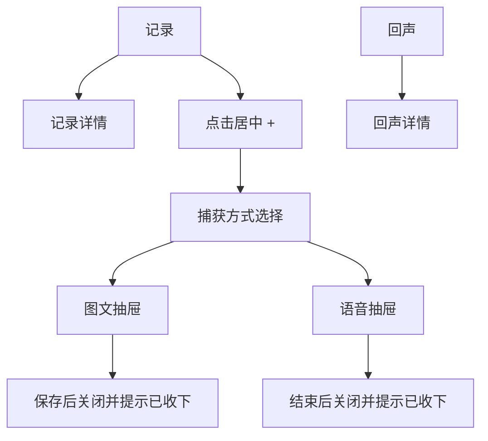

# Loomi H5 UI 设计规范（iOS / Android 实现参考）

> 版本：1.0  
> 依据：当前 H5 成品交互  
> 适用范围：iOS 与 Android 的首版界面实现

## 1. 设计定位

Loomi 是帮助用户持续积累、回看和整理念头的工具。每一条记录是一根“线”，Loomi 将线收集、梳理并逐步编织，最终在“回声”中形成可回看的主题与关联。

界面应安静、克制、有质感，服务于重视自我成长与效率的职场用户，但不制造任务感或绩效压力。避免绿色、强激励图表、密集标签和办公软件式的信息堆叠。

Loomi 吉祥物是品牌叙事中的收集者与编织者，不作为记录页或回声页标题栏的装饰图标。

## 2. 信息架构

产品主导航只有两个内容页；“+”是居中的捕获入口，不是独立页面。

| 主导航 | 目的 | 当前内容 |
| --- | --- | --- |
| 记录 | 回看已捕获的念头 | 时间线记录列表与记录详情 |
| + | 快速捕获 | 弹出图文、语音两种方式 |
| 回声 | 回看整理后的关联 | 现有主题列表与主题详情 |

## 3. 视觉基础

### 3.1 色彩

整体使用暖纸白与雾蓝灰。蓝灰用于表达线条、收集和沉静思考；不使用绿色作为品牌或主操作色。

| 令牌 | 色值 | 用途 |
| --- | --- | --- |
| 页面纸白 | `#F8F7F5` | 页面主背景 |
| 内容表面 | `#FFFEFD` | 卡片、抽屉与输入区域 |
| 主文字 | `#2D3038` | 标题、正文、主要图标 |
| 次文字 | `#5E626C` | 描述、辅助正文 |
| 弱文字 | `#888990` | 时间、占位和未激活状态 |
| 边线 | `#E2E2E6` | 分隔线、输入框轮廓 |
| 品牌蓝灰 | `#657895` | 重点状态、线条节点、已选状态 |
| 浅蓝灰 | `#EDF0F5` | 轻量背景、选中面 |
| 深色操作 | `#303743` | 居中 + 按钮、重要操作 |
| 遮罩 | `rgba(32, 36, 45, 0.48)` | 抽屉展开时的页面遮罩 |

### 3.2 字体与尺寸

使用系统中文字体：iOS 优先 `PingFang SC`，Android 优先 `Noto Sans SC` 或系统默认无衬线字体。不要引入装饰性字体。

| 场景 | 建议字号 | 字重 | 行高 |
| --- | --- | --- | --- |
| 页面标题 | 24 | 600 | 32 |
| 区块标题 | 18 | 600 | 26 |
| 列表正文 | 16 | 400–500 | 24 |
| 辅助说明 | 14 | 400 | 21 |
| 导航标签 | 12 | 500 | 18 |
| 微型提示 | 12 | 400 | 18 |

### 3.3 间距、圆角与层次

- 采用 4 的倍数间距体系：4、8、12、16、20、24、32。
- 页面水平边距为 20；抽屉内容水平边距为 24。
- 常规卡片圆角为 14；底部抽屉顶部圆角为 20。
- 分隔优先使用细线和留白，少用阴影；需要抬升感时使用低对比、扩散较大的柔和阴影。
- 线条语言用于时间线、进度节点与轻量连接关系，保持细、疏、低对比，避免变成复杂的装饰图案。

## 4. 主导航

底部导航固定在安全区上方，顺序为“记录、+、回声”。导航背景与页面纸白融合，上边可使用极浅分隔。

| 元素 | 规范 |
| --- | --- |
| 普通导航项 | 图标在上、文字在下；未选中使用弱文字，选中使用主文字或品牌蓝灰 |
| 居中 + | 直径 54；深色圆形；视觉上向上抬升约 27；白色加号 |
| 点击热区 | iOS 不小于 44×44 pt；Android 不小于 48×48 dp。居中 + 的可点击区应大于可视圆形 |
| 当前页 | 记录与回声各自只有一个选中状态；+ 不维持选中态 |

进入记录页作为默认落点。不要在底部导航中增加“捕获”文字页签，也不要将捕获做成第三个根页面。

## 5. 记录页

记录页只负责回看内容，不提供输入框、快捷输入条或右上角新增按钮。新增入口统一由底部居中 + 承担。

### 页面结构

1. 顶部：页面标题与简短说明，右上角留空，不展示原型形象或品牌图标。
2. 主体：按时间倒序排列的记录时间线。
3. 底部：固定三栏导航。

### 时间线列表

- 每条记录左侧为一枚约 7 的圆点，颜色使用低饱和蓝灰；圆点外可有非常浅的同色扩散环。
- 圆点之间由细竖线连接，竖线颜色建议使用 `#E6E5E8`。
- 列表内容相对时间线向右缩进约 20。
- 单条显示正文摘要、时间、关联主题等现有数据；正文过长时多行截断，点击进入记录详情。
- 时间线是信息结构，不要求每条记录都有强边框卡片。优先用留白、细线和文字层级建立秩序。
- 空状态提示用户通过底部 + 收集第一根线，不在页面中增加输入控件。

## 6. 回声页

回声页保留现有 H5 的主题列表、详情和内容组织逻辑。它表达的是已被整理出的关联与回看，不应做成工作待办或项目看板。

- 顶部同样不显示右上角 Loomi 图标或其他装饰图标。
- 主题卡片、摘要、更新时间与详情层级沿用当前 H5 信息模型。
- 回声页中的线条、分隔和浅蓝灰底可提示“编织后的脉络”，但不能影响长文本的阅读。
- 点击主题进入主题详情；详情页可保留返回层级，底部主导航按当前容器逻辑展示。

## 7. 捕获入口与底部抽屉

点击居中 + 后，从底部弹出“捕获方式选择”抽屉。页面其余区域覆盖半透明深色遮罩，点击遮罩或关闭按钮均可关闭。

### 7.1 方式选择抽屉

| 项目 | 内容 |
| --- | --- |
| 标题 | 可使用“收集这一刻”一类平静、具体的表达 |
| 选项 | 仅保留“图文”“语音”两项 |
| 图文 | 图标与一句简短说明，进入图文抽屉 |
| 语音 | 图标与一句简短说明，进入语音抽屉 |
| 关闭 | 顶部关闭按钮或点击遮罩关闭 |

当前版本不展示相册、链接、社交链接、文件等额外类型。

### 7.2 图文抽屉

选择“图文”后，底部向上切换为编辑抽屉。

| 区域 | 规范 |
| --- | --- |
| 顶栏 | 左侧返回方式选择，右侧关闭；标题清晰表明图文记录 |
| 文本输入 | 多行输入区域；占位文案为“这一刻，有什么值得留下？” |
| 图片 | 提供“添加图片”的轻量入口；选中后展示已添加图片的界面状态与移除入口 |
| 保存 | 有文字时可保存；保存成功后关闭抽屉，并显示“Loomi 已收下这根线。” |

当前 H5 中，文本保存会调用既有记录创建能力；图片仅展示选择后的界面状态，尚未上传、持久化或绑定到记录。原生实现应在接口就绪后再接入真实相册选择与上传流程。

### 7.3 语音抽屉

选择“语音”后，展示聚焦于一次录音的简洁抽屉。界面中的录音状态如下：

| 状态 | 主操作 | 辅助操作 | 视觉反馈 |
| --- | --- | --- | --- |
| 未开始 | 开始 | 返回、关闭 | 静态录音提示 |
| 录音中 | 暂停、结束 | 无 | 录音波纹或节奏指示，突出“录音中” |
| 已暂停 | 继续、结束 | 无 | 明确显示“已暂停”，波纹停止 |
| 已结束 | 自动关闭 | 无 | 提示“Loomi 已收下这段声音。” |

当前 H5 只演示状态转换：不申请麦克风权限、不写入音频文件、不上传音频，也不创建真实语音记录。原生端在接入能力时，应先处理权限、录音中断、来电/后台、保存失败和重试等平台行为。

### 7.4 动效

- 遮罩淡入淡出约 200 ms。
- 抽屉由下向上滑入，时长约 250 ms，使用自然减速曲线。
- 图文与语音切换保持同一抽屉容器，只切换内部内容，避免页面跳转感。
- 结束录音、保存记录后，先给出简短收集提示，再关闭抽屉；不使用庆祝、撒花等高刺激动效。
- 系统开启“减少动态效果”时，使用透明度变化替代位移动画。

## 8. 状态与反馈

### 收集完成提示

提示位于底部导航上方，使用短暂浮层，不遮挡主导航。文案保持自然、低压力：

- 图文完成：`Loomi 已收下这根线。`
- 语音完成：`Loomi 已收下这段声音。`

提示应同时提供无障碍语义播报，避免仅用颜色传达成功。

### 加载、空状态与错误

- 列表加载使用简洁骨架或文字等待，不使用跳动的完成进度。
- 记录页空状态指向底部 +，语言鼓励积累，不要求立即完成目标。
- 网络错误沿用现有页面错误呈现；错误信息应说明可做的下一步，例如重试或返回。

## 9. 原生平台实现要求

### 容器与安全区

- iOS：底部导航和抽屉须避开 Home Indicator；抽屉可使用系统样式底部弹层或自定义 sheet。
- Android：适配手势导航条、三键导航和边到边布局；抽屉可使用 Modal Bottom Sheet 或等效组件。
- 抽屉展开时，背景页禁止继续响应列表点击和底部导航点击。
- 键盘弹出时，图文输入区和保存操作必须可见；关闭键盘不应丢失输入内容。

### 输入与媒体能力边界

| 能力 | 当前界面状态 | 原生接入建议 |
| --- | --- | --- |
| 文字记录 | 已接入既有创建记录能力 | 复用当前记录创建接口，成功后刷新记录时间线 |
| 添加图片 | 仅有界面占位与已添加状态 | 接口确定后接入系统相册选择、压缩、上传、删除与失败重试 |
| 语音记录 | 仅有录音状态演示 | 接口确定后接入权限申请、真实录音、音频预览、上传与断点恢复 |

图片与音频在服务端接口未定义前，不应伪装为已真实保存。若用户关闭图文或语音抽屉，按平台习惯提示放弃未保存内容，或在明确的本地草稿策略下保留。

### 无障碍

- 所有图标按钮提供中文无障碍标签，例如“打开捕获方式”“关闭捕获”“添加图片”“暂停录音”。
- 录音状态变化、收集完成提示使用可访问的实时提示区域。
- 支持系统字号放大；文本区域、列表摘要和底部标签不能因放大而互相覆盖。
- 保证文字与背景的可读对比度；不可只靠颜色区分导航选中、录音状态或完成状态。

## 10. 实现验收清单

- [ ] 根导航只有“记录、+、回声”，默认进入记录。
- [ ] 记录页与回声页标题栏右上角均不出现原型形象或装饰图标。
- [ ] 记录页为纯时间线回看，页面中没有输入入口。
- [ ] 居中 + 点击后只显示图文和语音两种方式。
- [ ] 图文采用底部抽屉，具备输入、添加图片界面状态、保存与关闭反馈。
- [ ] 语音采用底部抽屉，完整呈现开始、暂停、继续、结束状态。
- [ ] 语音结束后显示“Loomi 已收下这段声音。”并关闭抽屉。
- [ ] 颜色不使用绿色主调，整体保持纸白、深灰与蓝灰的低压氛围。
- [ ] iOS 与 Android 均正确处理安全区、键盘、点击热区和无障碍标签。

## 11. 当前 H5 对照文件

本规范以以下实现为准，原生实现前如有交互调整，应先同步更新本文件：

- `apps/h5/src/components/layout.tsx`：主导航、居中 +、完成提示与抽屉容器。
- `apps/h5/src/components/capture-sheet.tsx`：方式选择、图文与语音抽屉状态。
- `apps/h5/src/pages/records/index.tsx`：记录页时间线。
- `apps/h5/src/pages/topics/index.tsx`：回声页现有内容逻辑。
- `apps/h5/src/loomi.scss`：颜色、时间线、导航和抽屉的视觉样式。
