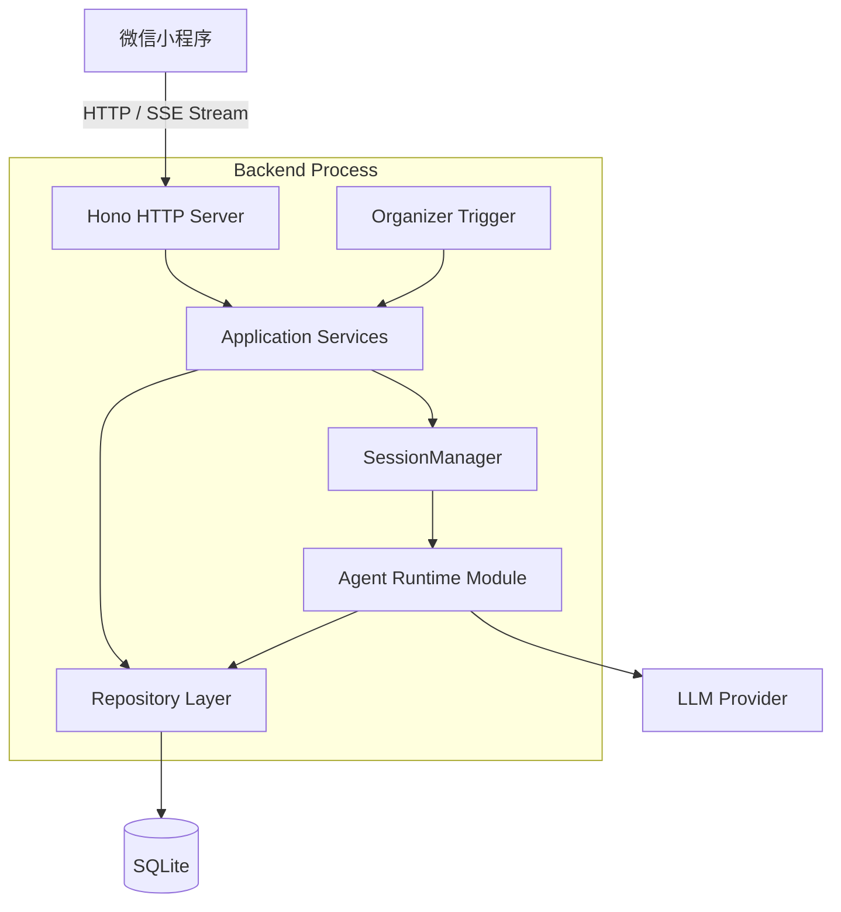
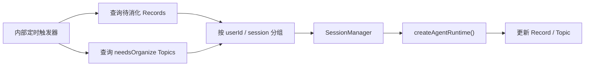
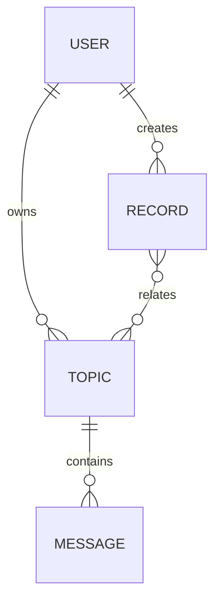
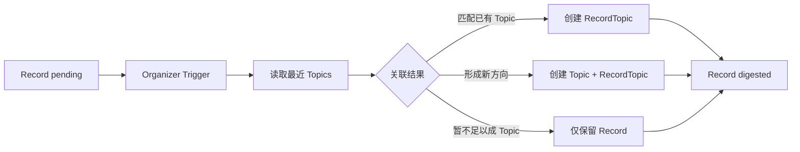
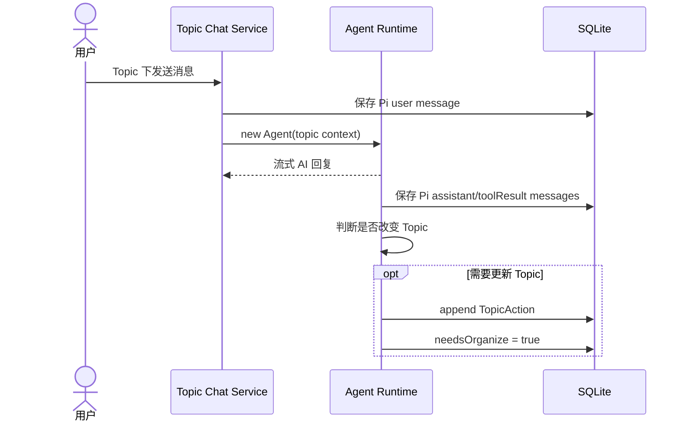
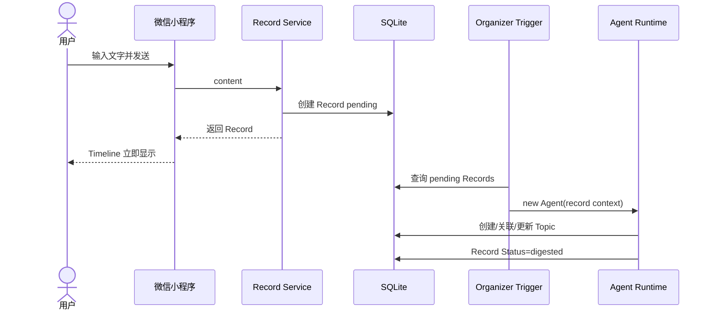
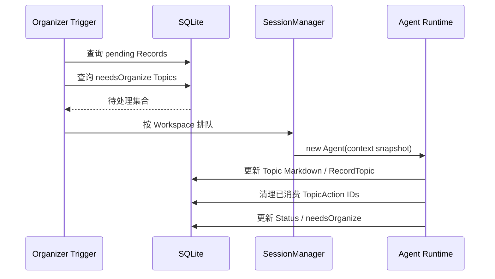
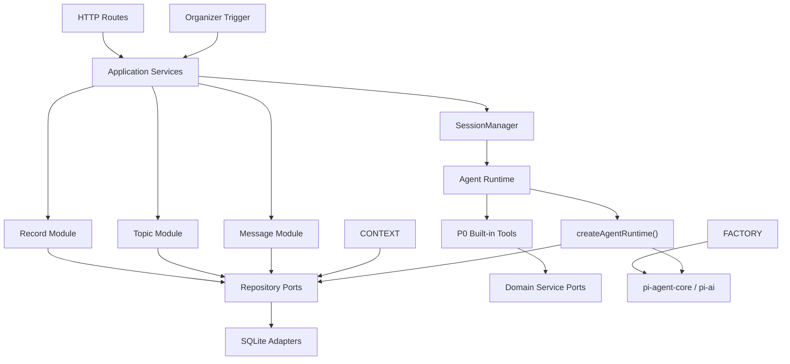

# AI 碎片思考助手：后端技术架构

> MVP 载体：微信小程序  
> 架构形态：Hono + pi-agent-core 模块化单体 + SessionManager  
> 日期：2026-09-03

## 1. 方案定稿

后端采用以下结构：

- HTTP Server 和 Agent Runtime 在同一个 Node.js 进程中。
- Agent 通过 SessionManager 管理，WorkspaceKey = `userId:sessionId`，per-thread 持有 AgentRuntime。
- SQLite 保存 Record、Topic 和 Message。
- 后台触发器直接扫描：
  - 新增或尚未消化的 Record；
  - 带有 Pending Actions、需要重新整理的 Topic。
- Topic 正文使用 Markdown。

核心领域：

```text
Record + Topic
```

支撑数据：

```text
Message + RecordTopic
```

---

## 2. 总体架构



### 2.1 HTTP Server

包含：

- Record 创建和查询；
- Topic 列表、详情和对话入口；
- 根据 `topicId + sessionId` 获取 Message 历史；
- Agent Chunk Stream；
- 微信登录态转业务 userId。

### 2.2 Agent Runtime

Agent Runtime 是后端模块，不是独立服务：

```ts
const context = await contextBuilder.build({
  userId,
  sessionId,
  topicId,
});

const agent = agentFactory.create(context);
await agent.prompt(message);
```

运行结束后释放 Agent 实例。长期状态都在 SQLite：

- Topic 当前正文；
- Record 原始内容和整理状态；
- Message 原始 Pi 格式；
- Topic Pending Actions。

### 2.3 SessionManager

Workspace Key：

```ts
type WorkspaceKey = `${userId}:${sessionId}`;
```

SessionManager 保证一个 Workspace 同时只有一次 Agent 执行。不同用户或不同 Session 可以并行。

Session 分配：

- Topic 创建时生成 `sessionId`；
- Topic 的多轮对话和自动整理使用同一个 Session；
- 尚未归属 Topic 的 Record 整理使用用户级系统 Session：`userId:records`；
- Session 不对应进程、目录或独立数据库。

### 2.4 Organizer Trigger

后台不再扫描 Inbox，而是直接扫描领域状态：



触发周期是内部配置，不对用户承诺固定心跳时间。没有新 Record 和待整理 Topic 时不调用模型。

---

## 3. 领域模型总览



### 3.1 模型清单

| 对象 | 类型 | 作用 |
|---|---|---|
| Record | 核心领域 | 保存用户首页入口产生的原始记录 |
| Topic | 核心领域 | 保存 AI 持续整理的 Markdown 内容 |
| RecordTopic | 关系对象 | Record 与 Topic 多对多关联 |
| Message | 支撑数据 | 保存 Topic 下的 Pi Agent 原始消息 |

---

## 4. Record 领域

### 4.1 定义

用户从首页主入口提交的内容，创建完成后直接成为 Record，不经过 InboxItem。

一条 Record 的内容只有必需的文本 `content`。

不设置 `contentType` 和 `action`。

### 4.2 Record 模型

```ts
type Record = {
  id: string
  userId: string

  source: 'home'
  content: string
  topicIds: string[]

  status: 'pending' | 'processing' | 'digested'

  occurredAt: string
  createdAt: string
  updatedAt: string
}
```

### 4.3 字段说明

| 字段 | 说明 |
|---|---|
| source | P0 固定为 `home`，保留字段方便未来增加分享入口等来源 |
| content | 必需、非 NULL；用户输入的原文 |
| topicIds | 对外 Record 对象中的多个 Topic ID |
| status | 标识是否已经被后台整理和关联 |

不再保留：

```text
contentType
action
taskId
sourceMessageId
availableAt
startedAt
completedAt
error
```

### 4.4 Record 与 Topic 多对多

领域对象向外暴露 `topicIds: string[]`，数据库使用简单关系表：

```ts
type RecordTopic = {
  recordId: string
  topicId: string
  createdAt: string
}
```

不把 Topic IDs JSON 直接存进 Record 表，避免 Topic 详情查询相关记忆时扫描和解析所有 Records。

### 4.5 Record 消化逻辑



`digested` 只表示系统已经判断过，不表示一定关联了 Topic。

---

## 5. Topic 领域

### 5.1 定义

Topic 对应用户看到的一条“回声”。它保存当前 Markdown 正文，以及多轮对话后等待 AI 吸收的 Pending Actions。

MVP 不保存 Topic 版本历史。

### 5.2 Topic 模型

```ts
type Topic = {
  id: string
  userId: string
  sessionId: string

  title: string
  summary: string
  bodyMarkdown: string
  tags: string[]
  
  pendingActions: TopicAction[]
  needsOrganize: boolean

  status: 'active' | 'archived'
  createdAt: string
  updatedAt: string
}
```

### 5.3 TopicAction

TopicAction 不是 Task，不单独建表。它是 Topic 中一个等待下次整理的轻量 JSON 项：

```ts
type TopicAction = {
  id: string
  type: 'merge_insight' | 'correct' | 'reorganize'
  instruction: string
  createdAt: string
}
```

含义：

| type | 用途 |
|---|---|
| merge_insight | 将本轮新增判断、结论或行动建议融入 Topic |
| correct | 用户纠正了 Topic 中的理解 |
| reorganize | 用户明确要求阶段性总结或重新组织正文 |

`instruction` 是直接给 Organizer Agent 的整理指令，不是用户待办任务。

### 5.4 needsOrganize

`needsOrganize` 是冗余扫描字段：

- `pendingActions` 新增内容时设为 `true`；
- Trigger 只扫描 `needsOrganize=true` 的 Topics；
- Organizer 根据 Topic 当前正文、相关 Records 和 Pending Actions 生成完整新正文；
- 成功后删除本次已消费的 Action；
- 没有剩余 Action 时设为 `false`；
- 整理期间新产生的 Action 不应被误删除，只清理本次输入快照中的 Action IDs。

### 5.5 对话如何触发 Action



P0 不执行 Topic 下的调研或其他长 Task；对话只包含普通多轮交流和 TopicAction 提取。

### 5.6 Topic 自动整理

Organizer 输入：

```ts
type TopicOrganizeContext = {
  topic: {
    title: string
    summary: string
    bodyMarkdown: string
  }
  relatedRecords: Array<{
    id: string
    content: string
  }>
  pendingActions: TopicAction[]
  recentMessages: PiAgentMessage[]
}
```

输出：

```ts
type TopicOrganizeResult = {
  title: string
  summary: string
  bodyMarkdown: string
  relatedRecordIds: string[]
  consumedActionIds: string[]
}
```

模型输出完整 Topic Markdown，不执行简单字符串追加。

### 5.7 Topic Markdown

正文允许：

- 标题、段落、列表、引用和表格；
- 普通外部参考链接；
- Record 内部链接。

外部 Reference 直接写在 Markdown 中，不建立 Resource 或 SourceRef。

---

## 6. Message 模型

### 6.1 设计原则

Message 直接保存 Pi Agent 的原始事件格式，不再拆分 `content`、`tool_calls`、`response_metadata` 等字段。

只提取查询必需字段：

- userId；
- topicId；
- sessionId；
- role；
- timestamp。

完整事件原样保存在 `payload`。

### 6.2 Message 模型

```ts
type Message = {
  id: number
  userId: string
  topicId: string
  sessionId: string
  role: 'user' | 'assistant' | 'toolResult'
  payload: string
  timestamp: number
}
```

其中：

```ts
type PiMessageEvent = {
  type: 'message'
  message: PiAgentMessage
  timestamp: number
}
```

`payload = JSON.stringify(piMessageEvent)`。

### 6.3 保存示例

用户消息：

```json
{
  "type": "message",
  "message": {
    "role": "user",
    "content": "你好，做个自我介绍",
    "timestamp": 1788317490765
  },
  "timestamp": 1788317493128
}
```

Assistant 文本消息、Assistant ToolCall 和 ToolResult 都按相同方式完整写入 payload。

### 6.4 数据库表

```sql
CREATE TABLE messages (
  id INTEGER PRIMARY KEY AUTOINCREMENT,
  user_id TEXT NOT NULL,
  topic_id TEXT NOT NULL,
  session_id TEXT NOT NULL,
  role TEXT NOT NULL,
  payload TEXT NOT NULL,
  timestamp INTEGER NOT NULL
);
```

不再设置：

```text
message_id
type
content
tool_calls
tool_call_id
name
additional
response_metadata
updated_at
```

这些数据已经完整包含在 payload 的 Pi 原始消息中。

### 6.5 消息恢复

```ts
const rows = await messageRepository.listBySession({
  userId,
  topicId,
  sessionId,
  before,
});

const agentMessages = rows.map(row => {
  const event = JSON.parse(row.payload) as PiMessageEvent;
  return event.message;
});
```

`id` 用于历史消息分页，`timestamp` 保留 Pi 的原始顺序语义。

---

## 7. SQLite 数据模型

P0 业务表：

```text
users
records
topics
record_topics
messages
```

### 7.1 records

```sql
CREATE TABLE records (
  id TEXT PRIMARY KEY,
  user_id TEXT NOT NULL,
  source TEXT NOT NULL DEFAULT 'home',
  content TEXT NOT NULL,
  status TEXT NOT NULL DEFAULT 'pending',
  occurred_at TEXT NOT NULL,
  created_at TEXT NOT NULL,
  updated_at TEXT NOT NULL
);
```

### 7.2 topics

```sql
CREATE TABLE topics (
  id TEXT PRIMARY KEY,
  user_id TEXT NOT NULL,
  session_id TEXT NOT NULL,
  title TEXT NOT NULL,
  summary TEXT NOT NULL DEFAULT '',
  content TEXT NOT NULL DEFAULT '',
  pending_actions TEXT NOT NULL DEFAULT '[]',
  needs_organize INTEGER NOT NULL DEFAULT 0,
  status TEXT NOT NULL DEFAULT 'active',
  created_at TEXT NOT NULL,
  updated_at TEXT NOT NULL
);
```

### 7.3 record_topics

```sql
CREATE TABLE record_topics (
  record_id TEXT NOT NULL,
  topic_id TEXT NOT NULL,
  created_at TEXT NOT NULL,
  PRIMARY KEY (record_id, topic_id)
);
```

### 7.4 messages

```sql
CREATE TABLE messages (
  id INTEGER PRIMARY KEY AUTOINCREMENT,
  user_id TEXT NOT NULL,
  topic_id TEXT NOT NULL,
  session_id TEXT NOT NULL,
  role TEXT NOT NULL,
  payload TEXT NOT NULL,
  timestamp INTEGER NOT NULL
);
```

JSON 仅用于：

- `topics.pending_actions`；
- `messages.payload`。

Record 与 Topic 的关联使用关系表，不使用 JSON 数组。

---

## 8. 整体数据链路

### 8.1 首页文字输入



### 8.2 Topic 多轮对话

```mermaid
sequenceDiagram
    actor U as 用户
    participant MP as 微信小程序
    participant API as Topic Chat Service
    participant DB as SQLite
    participant AG as Agent Runtime
    participant LLM as Model Provider

    U->>MP: 发送消息
    MP->>API: topicId + sessionId + prompt
    API->>DB: 保存 Pi user message payload
    API->>AG: sessionManager.getOrCreate()
    AG->>DB: 加载 Topic / Records / Messages
    AG->>LLM: prompt
    LLM-->>AG: stream + optional tool calls
    AG-->>API: stream events
    API-->>MP: SSE stream
    AG->>DB: 保存 assistant/toolResult payloads
    opt 本轮改变 Topic
        AG->>DB: append pendingAction
        AG->>DB: needsOrganize=true
    end
```



### 8.3 自动整理



---

## 9. 模块依赖



依赖规则：

- HTTP Routes 和 Trigger 只调用 Application Services。
- Agent Tools 不直接写 SQLite。
- Domain Modules 不依赖 Hono、SQLite 或 Pi。
- Agent Runtime 不通过 HTTP 调用本服务。
- SQLite 通过 Repository Adapter 隔离，未来替换 PostgreSQL。

---

## 10. 后端技术栈

| 能力 | 技术选择 |
|---|---|
| 语言 | TypeScript / Node.js LTS |
| HTTP | Hono + @hono/node-server |
| Schema | Zod |
| Agent Runtime | `@earendil-works/pi-agent-core` |
| 多模型 | `@earendil-works/pi-ai` |
| 数据访问 | Kysely |
| 数据库 | better-sqlite3 + WAL |
| 定时触发 | 轻量进程内 Scheduler |
| Markdown | remark / unified 安全子集 |
| 日志 | console |
| 开发运行 | tsx |
| 测试 | Vitest |

### 10.1 SQLite 使用边界

- MVP 后端单实例部署。
- SQLite 文件放在持久化磁盘。
- 开启 WAL。
- HTTP Server、Trigger 和 Agent Runtime 共享同一个 Repository 层。
- 横向扩容前切换 PostgreSQL。
- 不引入向量数据库；P0 使用普通文本、最近 Topic 和 Agent 判断完成关联。

---

## 11. 后端目录

```text
backend/
├── package.json
├── pnpm-lock.yaml
├── src/
│   ├── main.ts
│   ├── app.ts
│   ├── config/
│   │   ├── config.ts
│   │   └── env.ts
│   ├── http/
│   │   ├── server.ts
│   │   ├── middleware/
│   │   ├── routes/
│   │   │   ├── records.routes.ts
│   │   │   ├── topics.routes.ts
│   │   │   ├── messages.routes.ts
│   │   │   └── agent.routes.ts
│   │   └── stream/
│   │       └── chunk-writer.ts
│   ├── application/
│   │   ├── create-record.service.ts
│   │   ├── process-record.service.ts
│   │   ├── topic-chat.service.ts
│   │   └── organize-topic.service.ts
│   ├── modules/
│   │   ├── record/
│   │   │   ├── record.ts
│   │   │   ├── record.repository.ts
│   │   │   └── record.service.ts
│   │   ├── topic/
│   │   │   ├── topic.ts
│   │   │   ├── topic-action.ts
│   │   │   ├── record-topic.ts
│   │   │   ├── topic.repository.ts
│   │   │   └── topic.service.ts
│   │   └── message/
│   │       ├── message.ts
│   │       └── message.repository.ts
│   ├── agent/
│   │   ├── agent-runtime.ts
│   │   ├── agent-factory.ts
│   │   ├── agent-context.ts
│   │   ├── context-builder.ts
│   │   ├── session-runner.ts
│   │   ├── message-codec.ts
│   │   ├── model-provider.ts
│   │   ├── prompts/
│   │   │   ├── chat.prompt.ts
│   │   │   ├── record-digest.prompt.ts
│   │   │   └── topic-organize.prompt.ts
│   │   └── tools/
│   │       ├── search-records.tool.ts
│   │       └── read-topic.tool.ts
│   ├── scheduler/
│   │   ├── organizer-trigger.ts
│   │   └── scheduler.ts
│   └── infrastructure/
│       ├── database/
│       │   ├── database.ts
│       │   ├── schema.ts
│       │   ├── migrations/
│       │   └── repositories/
│       └── logger/
├── tests/
│   ├── unit/
│   ├── integration/
│   └── fixtures/
└── tsconfig.json
```

项目根目录保持：

```text
.
├── AGENTS.md
├── README.md
├── backend/
├── data/
├── docs/
├── frontend/
├── logs/
└── scripts/
```

不配置 pnpm workspace。Backend 和 Frontend 分别维护自己的依赖和锁文件。

---

## 12. 最终对象清单

### 12.1 保留

```text
Record
Topic
TopicAction（Topic JSON 字段，不建表）
RecordTopic
Message
```

### 12.2 删除

```text
InboxItem
Task
TaskRun
Artifact
Conversation
EchoRevision
Resource
SourceRef
EntityAttachment
```

### 12.3 后台扫描条件

```text
records.digest_status = pending
OR
topics.needs_organize = true
```

### 12.4 最小业务闭环

```text
首页输入
→ Record
→ 自动消化
→ 关联或创建 Topic
→ Topic 多轮对话
→ 产生 TopicAction
→ needsOrganize=true
→ 自动重写 Topic Markdown
```
