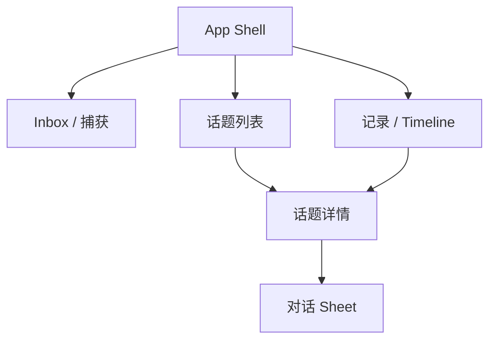
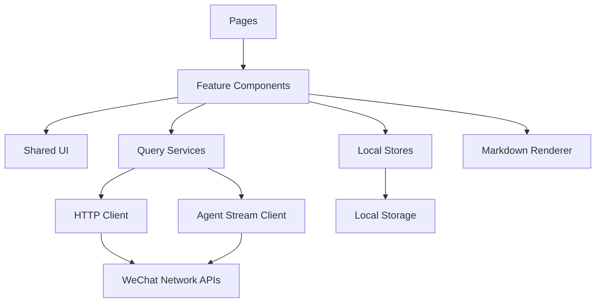
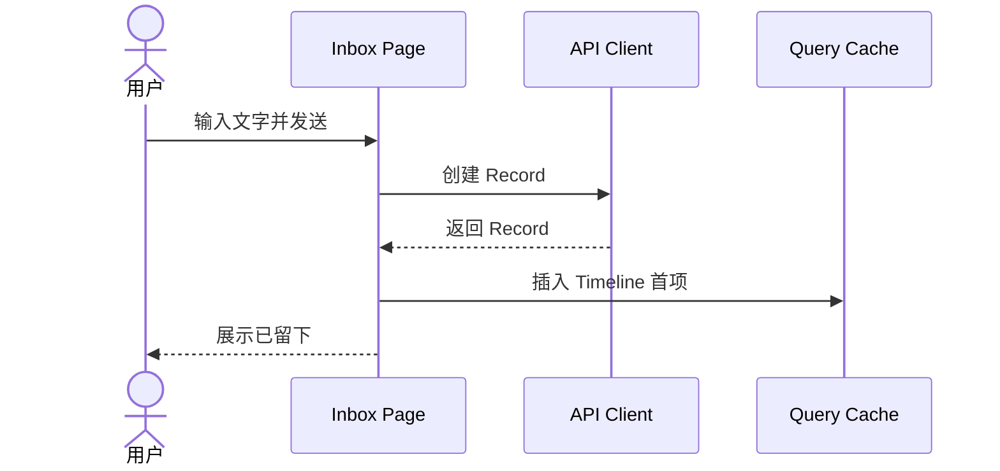
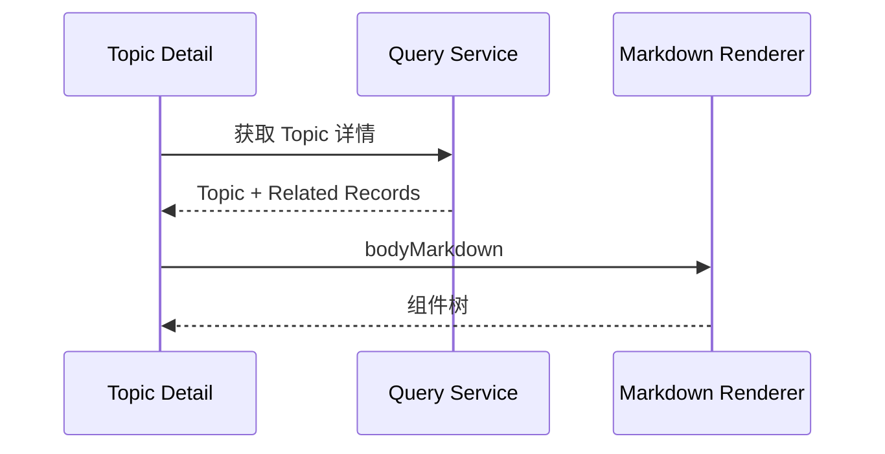
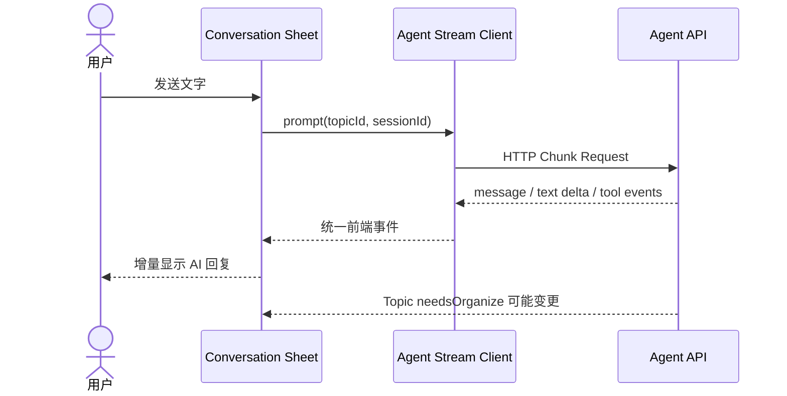
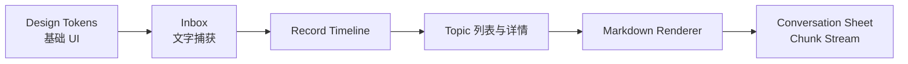

# AI 碎片思考助手：前端架构与 UI 方案

> MVP 载体：微信小程序  
> 产品基线：最后一版交互 Demo  
> 日期：2026-09-02

## 1. 前端方案

MVP 使用以下技术栈：

| 能力 | 方案 |
|---|---|
| 小程序框架 | Taro + React + TypeScript |
| 包管理 | 独立 pnpm 工程，不使用 Monorepo |
| 样式 | SCSS Modules + Design Tokens |
| 页面状态 | Zustand |
| 服务端数据 | TanStack Query 或轻量 Query 封装 |
| 普通请求 | Taro.request / wx.request |
| Agent 流式输出 | SSE（Server-Sent Events）|
| Markdown | MDAST 子集解析 + 自定义 Taro Renderer |
| 本地存储 | 未发送草稿、轻量页面缓存 |

前端只面向后端业务接口，不直接访问存储服务。

---

## 2. 页面结构



### 2.1 主导航

底部导航保持三个入口：

1. Inbox
2. 记录
3. 话题

不增加“我的”、回顾统计或任务中心。

### 2.2 Inbox 页面

Inbox 保持极简：

- 页面中央是快速文字输入区域。
- 提交成功后，Record 立即进入 Timeline。
- 后台是否已整理不影响用户继续捕获。

| 页面区域 | 内容 |
|---|---|
| 顶部 | `Inbox` 与当天日期 |
| 中央 | “有什么值得留下？”、文字输入区 |
| 底部输入区 | 快速文字输入与发送按钮 |
| 底部导航 | Inbox、记录、话题 |

### 2.3 记录页面

记录页只展示用户真实留下的 Record：

- 按发生时间倒序。
- 完整保留原始文字。
- 展示简单整理状态：`整理中 / 已整理`。
- 展示关联的一个或多个 Topic。

页面不展示后台错误堆栈、模型调用状态或复杂分类。

### 2.4 话题列表

每个 Topic 卡片展示：

- 标题；
- 一段直接结论或摘要；
- 更新时间；
- 是否有新内容，如一个低压力圆点标识；
- 不展示分类标签墙、统计次数和复杂状态。

### 2.5 话题详情

布局顺序固定：

1. 顶部导航和标题；
2. 相关记忆；
3. Topic Markdown 正文；
4. 底部对话入口。

相关记忆要求：

- 默认展开；
- 固定展示约两条的高度；
- 容器内部可以滚动查看更多；
- 保留展开/收起；
- 数据来自 Topic 关联的 Records；
- 对话 Message 不自动出现在相关记忆中。

### 2.6 对话 Sheet

点击 Topic 底部输入入口后：

- 从底部弹出高度约 88% 的 Sheet；
- 支持文字输入；
- 用户手动点击发送后才创建 Message；
- Agent 回复采用流式渲染；
- 对话本身不直接写入 Record；
- 多轮对话可能使 Topic 出现“等待整理”的轻量状态，但不展示固定任务按钮。

---

## 3. 前端模块依赖



### 3.1 模块职责

| 模块 | 职责 |
|---|---|
| Pages | 页面生命周期、路由参数、页面级数据组合 |
| Features | 捕获、Record、Topic、Chat 等业务交互 |
| Shared UI | 按钮、输入框、Sheet、Toast、空状态 |
| Query Services | 获取和刷新服务端数据 |
| Local Stores | 输入草稿、Sheet 等本地状态 |
| Agent Stream Client | 解析 HTTP Chunk，输出统一事件 |
| Markdown Renderer | 将 Markdown AST 渲染成小程序组件 |

---

## 4. 前端数据对象

前端只保留页面真正需要的读模型。

### 4.1 RecordView

```ts
type RecordView = {
  id: string
  text: string
  status: 'pending' | 'processing' | 'digested'
  topics: Array<{ id: string; title: string }>
  occurredAt: string
}
```

### 4.2 TopicView

```ts
type TopicView = {
  id: string
  title: string
  summary: string
  bodyMarkdown: string
  needsOrganize: boolean
  relatedRecords: RecordView[]
  sessionId: string
  updatedAt: string
}
```

### 4.3 MessageView

```ts
type MessageView = {
  id: number
  sessionId: string
  topicId: string
  role: 'user' | 'assistant' | 'toolResult'
  content: PiContent
  timestamp: number
}
```

---

## 5. 关键交互链路

### 5.1 快速文字捕获



提交后立即形成 Record。AI 后台整理只更新 `status` 和 Topic 关联，不影响原始记录展示。

### 5.2 打开 Topic



### 5.3 Topic 对话



### 5.4 对话语音输入（MVP 后）

对话 Sheet 中的语音 ASR 输入属于 P1 能力，MVP 仅支持文字输入。

---

## 6. Markdown 渲染

### 6.1 渲染范围

MVP 阶段的 Markdown Renderer 支持以下子集：

- 标题、段落、列表、引用和表格；
- 普通外部参考链接。

附件渲染（图片、音频、视频）属于 P1 能力，MVP 不涉及。

### 6.2 限制

- 不执行 Markdown 中的 HTML 和 JavaScript。
- 外部链接必须经过协议检查。

---

## 7. Agent Stream Client

页面不直接依赖 Pi Agent 原始事件，Stream Client 将服务端 Chunk 转换为前端事件：

```ts
type ClientAgentEvent =
  | { type: 'message_start'; role: string }
  | { type: 'text_delta'; text: string }
  | { type: 'tool_start'; name: string }
  | { type: 'tool_end'; name: string; isError: boolean }
  | { type: 'message_end' }
  | { type: 'error'; message: string }
```

Stream Client 负责：

- ArrayBuffer 解码；
- 跨 Chunk 半行拼接；
- SSE 事件解析；
- 页面取消时中断请求；
- 将完整 AI Message 写入 Query Cache；
- 流结束后刷新 Message History 和 Topic 状态。

---

## 8. 状态划分

### 8.1 服务端状态

通过 Query Cache 管理：

- Record 列表；
- Topic 列表和详情；
- Message History。

### 8.2 本地交互状态

通过 Zustand 管理：

- Inbox 文字草稿；
- Topic Sheet 开合；
- 对话输入草稿；
- 当前流式文本；
- Toast 和临时动画。

### 8.3 本地持久化

仅持久化：

- 未发送文字；
- 最近打开的 Topic ID。

不在本地长期保存完整 Topic 或完整 Message History。

---

## 9. UI 视觉令牌

### 9.1 色彩

| Token | 值 | 用途 |
|---|---:|---|
| canvas | `#e9ebe8` | 外层预览背景 |
| paper | `#f7f7f4` | 页面主背景 |
| surface | `#ffffff` | 输入框、局部容器 |
| ink | `#20231f` | 主文字 |
| body | `#4d534c` | 正文 |
| muted | `#757b73` | 次级说明 |
| faint | `#a4a9a2` | 时间和弱状态 |
| divider | `#e0e3dd` | 分割线 |
| accent | `#315f50` | 关联、状态 |
| accent-soft | `#e7efeb` | 柔和强调背景 |
| warm | `#8a6733` | 思考提示 |
| warm-soft | `#f3ede2` | 温暖提示背景 |

### 9.2 动效

| 动效 | 规格 |
|---|---|
| 页面切换 | 180ms，透明度 + 12px 水平位移 |
| Chat Sheet | 240ms，从底部进入，高度约 88% |
| 遮罩 | 200ms，`rgba(25,29,25,.24)` |
| Toast | 200ms，12px 位移 + 透明度 |

### 9.3 小程序适配

- 使用 `rpx` 建立布局尺寸，设计基准仍按当前 390–410px Demo。
- 底部导航、对话输入框处理 Safe Area。
- 真机减少大面积 `backdrop-filter`，用半透明纯色替代。
- Sheet 采用 transform 动画，不使用频繁改变高度的布局动画。

---

## 10. 前端目录

```text
frontend/
├── package.json
├── pnpm-lock.yaml
├── project.config.json
├── config/
│   ├── index.ts
│   ├── dev.ts
│   └── prod.ts
├── src/
│   ├── app.config.ts
│   ├── app.tsx
│   ├── app.scss
│   ├── pages/
│   │   ├── inbox/
│   │   │   ├── index.config.ts
│   │   │   ├── index.tsx
│   │   │   └── index.module.scss
│   │   ├── records/
│   │   ├── topics/
│   │   └── topic-detail/
│   ├── features/
│   │   ├── capture/
│   │   │   ├── QuickTextComposer.tsx
│   │   │   └── capture.store.ts
│   │   ├── record/
│   │   │   ├── RecordList.tsx
│   │   │   └── RecordRow.tsx
│   │   ├── topic/
│   │   │   ├── TopicList.tsx
│   │   │   ├── RelatedMemoryViewport.tsx
│   │   │   └── TopicBody.tsx
│   │   └── chat/
│   │       ├── ConversationSheet.tsx
│   │       ├── MessageList.tsx
│   │       └── ChatComposer.tsx
│   ├── components/
│   │   ├── markdown/
│   │   │   └── MarkdownRenderer.tsx
│   │   └── ui/
│   │       ├── BottomSheet.tsx
│   │       ├── IconButton.tsx
│   │       └── Toast.tsx
│   ├── services/
│   │   ├── api-client.ts
│   │   ├── agent-stream-client.ts
│   │   └── query-keys.ts
│   ├── stores/
│   │   ├── auth.store.ts
│   │   └── draft.store.ts
│   ├── theme/
│   │   ├── colors.ts
│   │   ├── motion.ts
│   │   ├── spacing.ts
│   │   └── typography.ts
│   ├── types/
│   └── utils/
├── tests/
└── tsconfig.json
```

---

## 11. 前端模块实施顺序



首个前端闭环：文字捕获 → Timeline → Topic → 打开详情 → 发一轮对话 → 查看流式回复。
