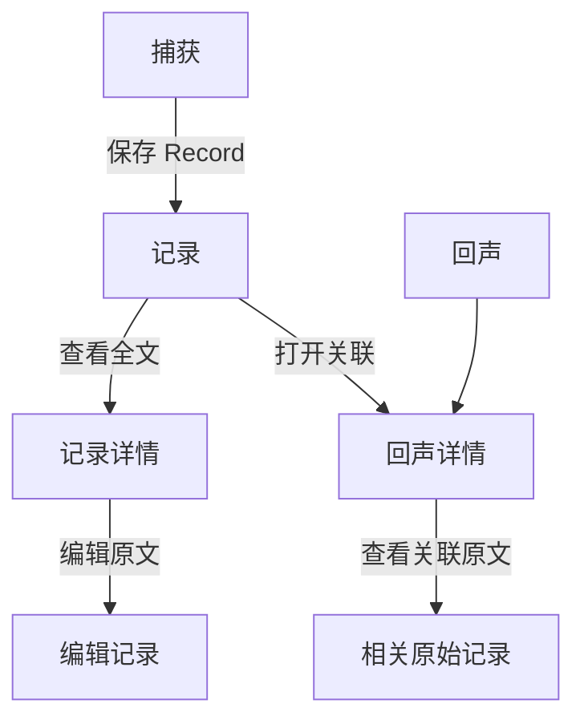

# Fanto 跨端前端功能与视觉复原指南

本文以当前 `apps/h5` 为视觉和交互基准，面向后续 Android、iOS 与原生微信小程序实现。它描述已实现行为，不为尚未实现的录音、Topic 对话、反馈、标签管理或正式认证预留界面。

配套视觉规格页：[frontend-visual-spec.html](frontend-visual-spec.html)。它不是新的产品页面，而是实现时比对颜色、层级、间距和组件状态的参考。

## 产品结构

### 信息层级

| 对象 | 用户看到的内容 | 可操作项 |
|---|---|---|
| Record | 用户原文、创建时间、整理状态、当前关联 Topic | 打开详情、打开关联 Topic、编辑原文 |
| Topic | 标题、长期摘要、最近整理变化、标签、Markdown 正文 | 打开详情、展开或滚动关联原始记录 |
| 整理状态 | 待整理、整理中、已整理、暂未归入话题、内容已修改待重新整理 | 仅展示，不在前端改变状态 |

## 视觉基础

### 色彩令牌

| 用途 | 色值 | 使用原则 |
|---|---:|---|
| 页面纸色 | `#F7F7F4` | 所有主页面背景 |
| 纯白表面 | `#FFFFFF` | 输入框、白色容器 |
| 主文字 | `#20231F` | 标题、正文、深色图标 |
| 正文次级 | `#4D534C` | 摘要、说明性文字 |
| 辅助文字 | `#757B73` | 时间、帮助文字、未选中导航 |
| 分隔线 | `#E0E3DD` | 列表项与导航顶部，避免用于 Topic 详情关联区域 |
| 品牌绿色 | `#315F50` | 主按钮、活动状态、链接、关键标记 |
| 浅绿色 | `#E7EFEB` | Topic 标签、已整理状态、轻提示 |
| 摘要卡片 | `#EEF4F0` | Topic 详情摘要背景 |
| 摘要卡片边线 | `#DCE7E0` | 摘要卡片细边线 |
| 暖色状态底 | `#F3EDE2` | 待整理、整理中、修改待重整等状态标签 |

不要使用大面积高饱和色、渐变、厚阴影或高对比卡片。视觉应像低饱和纸张与墨色，不像任务管理后台。

### 字体与排版

- 中文优先系统无衬线：iOS 使用 PingFang SC，Android 使用系统 sans-serif，小程序使用系统字体栈。
- 正文基准 15–16sp；行高约 1.65–1.9。长原文、Markdown 正文优先可读性，不压缩行距。
- 页面标题约 28sp、字重 600–650；Topic 详情标题约 25sp；列表 Topic 标题约 18sp。
- 元信息 11–12sp；不可低于 11sp。
- `fanto.` 仅在捕获页右上角使用衬线字体（如 Georgia），其余文字保持无衬线。

### 尺寸与圆角

| 元素 | 规格 |
|---|---|
| 页面内容左右内边距 | 24dp，窄屏可降至 18dp |
| 主页面固定页头 | 112dp 高 |
| 底部导航可点击区 | 约 64dp，另加系统安全区 |
| 输入容器与摘要卡片圆角 | 8dp |
| 状态与 Topic 标签圆角 | 4–6dp |
| 主按钮圆角 | 胶囊形，约 24dp |
| 关联原始记录可见区 | 170dp，高度约容纳两条记录 |
| 关联原始记录左侧标记线 | 2dp，使用分隔线色 |

## 页面说明

### 1. 捕获

- 固定页头显示“捕获”、日期与 `fanto.` 标识。
- 内容区先展示深墨色圆形羽毛图标、文案“让想法先留下来。”和较浅说明。
- 输入框是白色、细边线、8dp 圆角的容器；支持多行文本。
- 输入框底部左侧显示字数或“随手记下就好”，右侧是绿色“记录”按钮。
- 保存中禁用按钮，文案变为“保存中…”。保存成功后保留页面，显示“已记录，等待整理成新的回声。”。
- 草稿需在本地持久化；网络失败时不清空原文，并提示结果待确认。

### 2. 记录列表

- 固定页头显示“记录”和“你的原始想法，始终留在这里。”。
- 每条 Record 顺序固定为：**原文（最多两行省略）→ 时间、状态、关联 Topic**。
- 原文点击进入详情。时间为普通弱化文字；状态为暖色浅底小标签；关联 Topic 为浅绿色可点击标签，带右上箭头图标。两者底色不可相同。
- 记录项使用底部分隔线；不使用卡片阴影。
- 空态文案为“还没有记录”，提供“记下第一个念头”入口。
- 分页使用底部“加载更多”，没有自动刷新按钮。

### 3. 回声列表

- 固定页头显示“回声”和“零散的想法，逐渐有了联系。”。
- 每项依次显示更新时间与未读点、标题及右上箭头、摘要、最近变化、标签。
- 最近变化使用左侧浅绿色竖线，包含“最近变化”、一段变化说明及本次涉及的记录数。
- 不显示“最近更新”筛选文案，也不显示手动“整理记录”按钮。
- 空态文案为“回声还在酝酿”。

### 4. 回声详情

- 这是完整的 Markdown 阅读页，页头不固定，不显示返回或刷新按钮。
- 页面顶部顺序：Topic 标题 → 更新时间与 Tag → 浅绿色摘要卡片 → 相关原始记录 → 最近变化 → Markdown 正文。
- 摘要卡片使用 `#EEF4F0`，细边线 `#DCE7E0`，不得使用深色填充。
- “相关原始记录”支持展开和收起；展开后内容区固定 170dp，内部纵向滚动。它本身和 Markdown 正文顶部都没有横向分隔线。
- 关联原始记录只显示时间和最多两行原文；不显示状态、Topic 标签或“本次涉及”。
- Markdown 支持标题、段落、列表、引用、代码块和表格；代码与表格可横向滚动。原始 HTML、图片、iframe 和可执行嵌入必须禁用或清洗。

### 5. 记录详情与编辑

- 记录详情展示完整原文，不做两行截断；显示创建时间、当前状态与编辑入口。
- 编辑页使用大面积文本输入区。保存后 Record 状态由服务端变为“内容已修改，待重新整理”。
- `processing` 状态下禁用编辑；相同内容保存不应更新状态或时间。

## 导航、滚动与交互

### 底部导航

三个一级入口固定于底部：捕获、记录、回声。未选中为浅灰绿色，选中为深墨色。图标描边较细，文字置于图标下方；点击区至少 44dp。

### 顶部行为

- 捕获、记录、回声三个一级页面使用 112dp 固定或吸附式页头；内容从页头下方滚动。
- 回声详情不使用固定顶部，保证 Markdown 阅读连续性。
- 详情页均不显示刷新按钮。回声详情不显示返回按钮，用户可使用底部导航离开。

### 动效原则

当前实现不依赖装饰性动画。跨端复原时也应保持克制：

- 点击、展开和收起使用 120–180ms 的透明度或高度过渡即可；系统“减少动态效果”开启时立即完成。
- 保存、加载和整理中使用文案与禁用态反馈，不使用循环性大动画。
- 底部导航切换优先使用平台原生的轻量页面切换；避免夸张的缩放、弹簧和全屏转场。

## 数据与状态映射

| 场景 | UI 行为 | 不应发生的行为 |
|---|---|---|
| Record 创建成功 | 清理已提交部分，保留请求期间继续输入的草稿 | 不自动创建虚构 Topic |
| 创建请求失败或超时 | 保留草稿，提示保存结果待确认 | 不自动重试 POST |
| `pending` | 显示“待整理” | 不显示关联 Topic |
| `processing` | 显示“整理中”，禁止编辑 | 不允许 PATCH |
| `organized` | 显示“已整理”与真实关联 Topic | 不从摘要推断关联 |
| `skipped` | 显示“暂未归入话题” | 不隐藏原始 Record |
| `updated` | 显示“内容已修改，待重新整理”，保留上轮整理说明 | 不提前清除旧关联与摘要 |
| Topic 归档 | 详情仍可读取，关联标签显示“已归档” | 不在 Topic 列表中展示 |

## 跨端实现边界

### 通用业务层

- 所有端复用 HTTP 契约与 `@fanto/shared` 的语义；原生端可根据 [HTTP API 文档](../api/http-api.md) 生成 Swift/Kotlin 数据模型。
- 请求携带开发期 `x-user-id`；它不是正式认证实现。
- 分页只信任 `hasMore` 与不透明 `nextCursor`，不使用 `total` 判断是否结束。
- 本地仅保存草稿与 Topic 已读标记；不要保存模型密钥、完整服务端响应或未清洗的 Markdown HTML。

### 平台建议

| 平台 | 建议组件 |
|---|---|
| Android | Jetpack Compose：`Scaffold`、`NavigationBar`、`LazyColumn`、`TextOverflow.Ellipsis`、`verticalScroll` |
| iOS | SwiftUI：`TabView`、`ScrollView`/`LazyVStack`、`lineLimit(2)`、`safeAreaInset` |
| 微信小程序 | 原生 `scroll-view`、自定义底部导航、`text` 的两行截断、WebView 或受控 Markdown 渲染器 |

对于关联原始记录，使用嵌套滚动容器时需阻止滚动事件穿透，并优先遵从系统手势。底部导航与安全区必须由各平台原生 API 处理，不能写死设备高度。

## 验收清单

- 主背景、文本、状态标签、Topic 标签和摘要卡片颜色与本文色值一致。
- 三个一级页面的页头高度一致，向下滚动时保持可见。
- 记录列表原文最多两行；记录详情显示全文。
- 回声详情摘要在关联原始记录之上；关联区固定约两条记录高度并可内部滚动。
- 回声详情及关联区没有多余横线；Markdown 正文顶部没有横线。
- 不出现刷新按钮、录音入口、Topic 多轮对话、反馈、Record tag 或标签管理。
- 小屏下不横向溢出，底部导航不遮挡最后一项内容。
