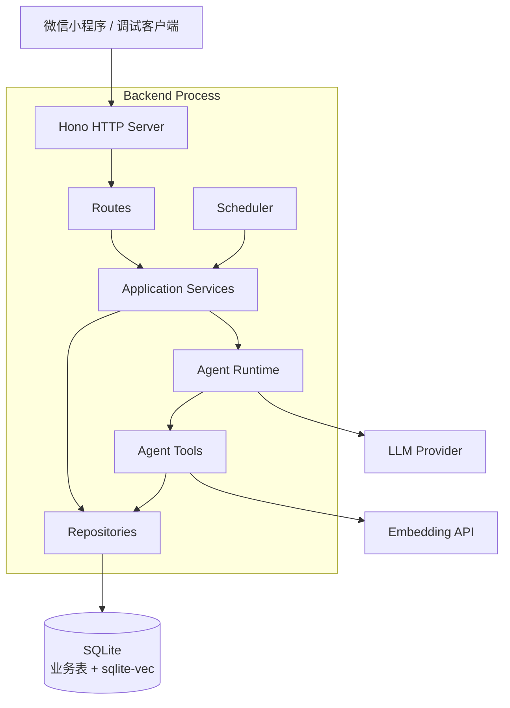
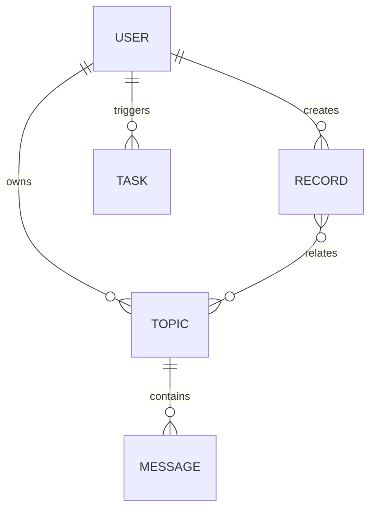
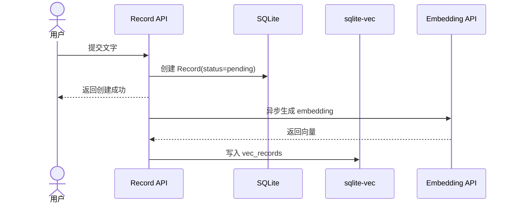
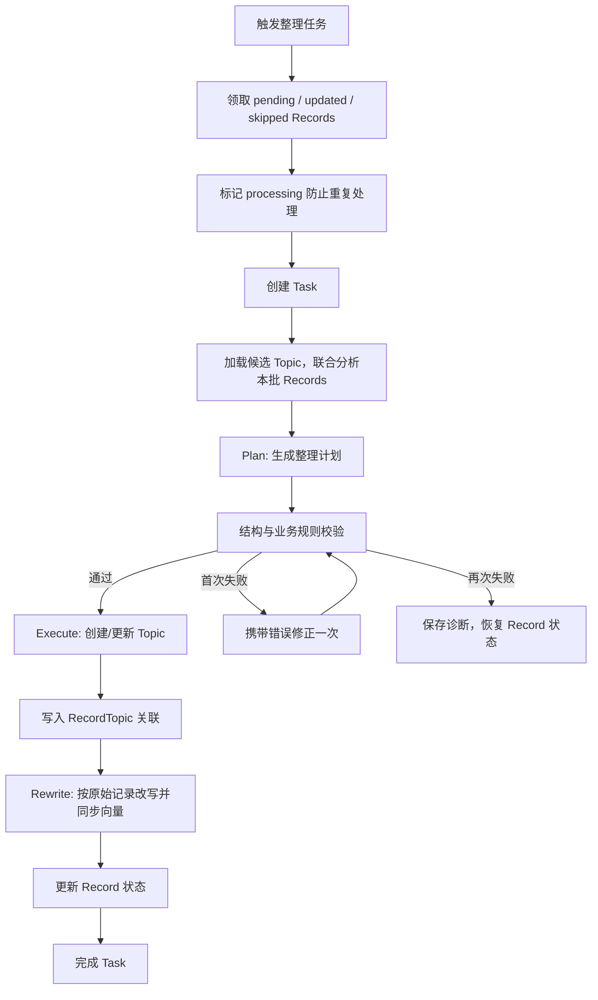
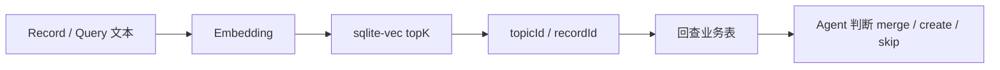
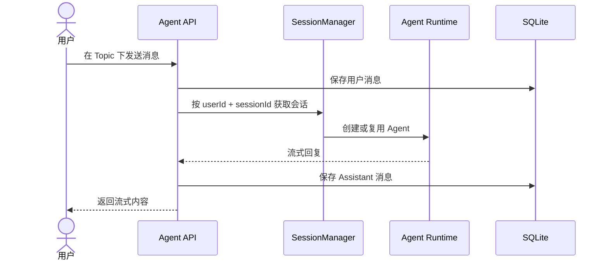

# 后端服务架构设计

本文档描述 Eiko 后端的高层架构和核心业务链路。重点是模块边界、数据流和 Agent 如何参与整理，不展开接口和字段细节。

文字 MVP 读模型已补齐：Record 列表批量附带当前 topics，提供单条 Record 详情；Topic 使用 updatedAt/id 复合游标，详情和现有消息查询限制用户归属，消息限制当前 Topic session。API DTO 与视图模型分离。真实 Topic 对话前后端暂缓，不实施上下文恢复、会话锁或流式持久化增强；正式认证和异步整理也仍为后续项。

## 1. 架构定位

Eiko 后端当前是一个面向 MVP 的模块化单体服务：

- HTTP 服务、Agent Runtime、调度触发器运行在同一个 Node.js 进程内。
- 业务数据使用 SQLite 持久化。
- 向量索引使用 `sqlite-vec`，和业务表保存在同一个 SQLite 数据库文件中。
- LLM 与 Embedding 能力通过外部模型服务提供。
- 代码按领域模块、应用服务、基础设施和路由分层。

这种结构优先服务 MVP 验证：部署简单、链路短、问题容易定位，同时保留后续拆分 Agent 服务或任务队列的空间。



## 2. 核心领域

后端围绕两个核心对象展开：

| 对象 | 作用 |
|---|---|
| Record | 用户随手留下的一条原始记录，保存真实表达 |
| Topic | AI 从多个 Record 中整理出的长期思考方向 |

支撑对象：

| 对象 | 作用 |
|---|---|
| RecordTopic | Record 与 Topic 的多对多关联 |
| Message | Topic 内多轮对话消息 |
| Task | 后台整理任务状态与结果 |



## 3. 核心链路

### 3.1 创建 Record

用户输入内容后，后端立即写入 Record。向量化是异步触发，不阻塞 Record 创建结果。



设计原则：

- 原始 Record 创建必须足够快。
- 向量化失败不影响用户继续记录。
- 后续可通过补偿任务重建向量索引。

### 3.2 Contemplate 整理任务

Contemplate 是当前 MVP 的核心整理链路，用于把待处理 Record 关联到已有 Topic，或创建新的 Topic。



Record 状态含义：

| 状态 | 含义 |
|---|---|
| pending | 新创建，尚未整理 |
| processing | 正在被任务处理，用于防重 |
| organized | 已整理并判断完成 |
| skipped | 本轮信息量不足或无沉淀价值，暂不形成 Topic |
| updated | 后续有变化，需要再次整理 |

任务失败时，会尽量把本次领取的 Record 恢复到进入任务前的状态，便于后续重试。

当前版本为 `contemplate-workflow-v2.2-simple`。JSON、动作结构和业务规则错误共享一次规划修正机会；模型连接错误和输出截断直接失败，执行器不自动重跑。所有涉及 Record 的动作使用非空且不重复的 `recordIds` 数组。完整规划输出和校验诊断保存在 `tasks.result.planningAttempts`。Record 状态恢复不等于已执行 Topic 写入的事务回滚。

records/topics 增加可空 ext_data，API 映射为 extData。最近成功决策及 Topic 变化保存在 organization 命名空间，与记录最终状态、任务完成状态一起事务提交；保留其他扩展数据。PATCH Record 后变为 updated，旧摘要保留。重整替换旧关联，原、新 Topic 均以当前有效关联记录为依据重写；空 Topic 归档。本轮不增加反馈能力。接口见 [HTTP 文档](../api/http-api.md)。

归并时先联合考察本批记录，候选 Topic 不构成强制分类列表；不相关记录不得放入“待探索”章节。正文以原始记录为依据，修正旧推断，不强制生成推断或问题章节。

### 3.3 向量搜索链路

向量搜索只负责召回候选，不直接决定业务结果。



当前维护两张向量表：

- `vec_records`：按 Record 原文建立索引。
- `vec_topics`：按 Topic 的标题、摘要、标签和正文摘要建立索引。

业务真相仍以主表为准，向量表是可重建索引层。

### 3.4 Topic 对话链路

Topic 的 `sessionId` 表示该 Topic 内多轮对话的会话，不等于整理任务的会话。自动整理任务有自己的临时 Agent session，不会写入 Topic 的 `sessionId`。



## 4. 模块边界

| 层级 | 主要职责 |
|---|---|
| Routes | HTTP 入参解析、响应格式、用户上下文 |
| Application Services | 组织核心业务流程，例如创建记录、整理任务、Topic 对话 |
| Agent | Prompt、Runtime、工具集合、事件收集 |
| Modules | 领域实体和 Repository 接口 |
| Infrastructure | SQLite、迁移、Repository 实现、向量索引、日志和时间工具 |
| Scheduler | 后台触发入口 |

## 5. 数据与时间

SQLite 是当前唯一持久化层。业务表和 `sqlite-vec` 虚拟表使用同一个数据库文件，路径由 `SQLITE_PATH` 指定。

应用内时间统一保存为本地时区 ISO 字符串，例如：

```text
2026-09-04T20:28:46.568+08:00
```

这样日志、接口返回和数据库记录在本地调试时保持一致。

## 6. MVP 取舍

当前设计刻意保留以下简单性：

- 不引入独立向量数据库服务。
- 不引入分布式任务队列。
- 不把 Agent 服务拆成独立进程。
- 不把 Topic 对话自动写入 Record。
- 不把向量索引作为业务真相。

后续当并发写入、任务补偿、模型调用成本或多用户隔离成为真实瓶颈时，再引入队列、独立 Agent Worker、任务重试表或外部向量数据库。
