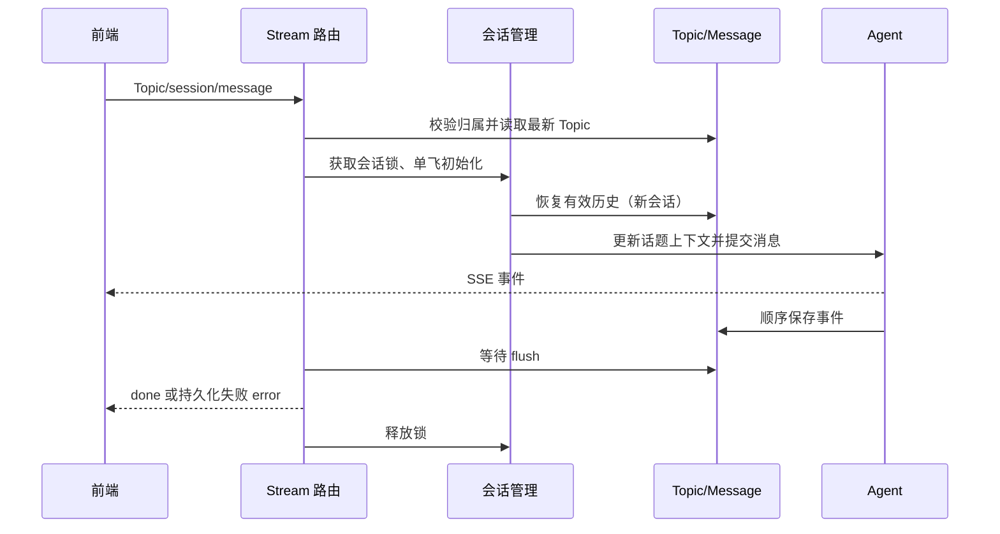

# 前端接入所需后端能力补齐方案

日期：2026-09-05。执行更新：P0 关联读模型、Record 详情、Topic 复合游标及现有详情/消息隔离已实现；真实 Topic 对话前后端均暂缓。下文 P1、认证与异步整理仍为未来设计，不代表已有能力。

来源：[前端设计](../docs/frontend/design.md)。任务清单：[backend-frontend-support-tasks.md](backend-frontend-support-tasks.md)。现有契约：[HTTP 文档](../docs/api/http-api.md)。

## 1. 范围与优先级

| 优先级 | 能力 | 对应前端依赖 |
|---|---|---|
| P0 | Record 当前归属读模型和单条详情 | B1：记录解释与原文溯源 |
| P0 | Topic 稳定游标分页 | B2：回声列表完整加载 |
| P0 | 已有详情/消息的开发用户归属校验 | B4 中可独立完成的基础校验 |
| P1 | Topic 对话上下文、历史恢复、会话并发和持久化 | B3：真实多轮对话 |
| 上线前 | 正式身份认证 | B4：真实多用户发布 |
| 后续 | 异步整理触发与恢复 | B5：可靠后台进度 |

优先交付 P0，不以认证系统、队列或完整对话重构阻塞文字 MVP。不新增反馈字段、Record tag、标签管理或整理事件表。继续使用 ext_data.organization 保存最近成功摘要。

## 2. Record 当前归属与详情

### 接口契约

GET /api/records 保持现有 topicId、limit、cursor 和响应外壳，每条 Record 新增 topics 数组。

新增 GET /api/records/:id，返回相同读模型。不存在或不属于当前用户返回 404/NOT_FOUND；使用当前 x-user-id 开发身份约定，不增加 public 查询入口。

```json
{
  "result": {
    "id": "record-id",
    "userId": "default-user",
    "source": "home",
    "content": "原始记录",
    "status": "organized",
    "createdAt": "...",
    "updatedAt": "...",
    "extData": {"organization": {"taskId": "...", "action": "merge_record", "reason": "补充验收方法", "organizedAt": "..."}},
    "topics": [{"id": "topic-id", "title": "AI 协作实践", "status": "active"}]
  },
  "success": true,
  "errorCode": null,
  "errorMsg": null
}
```

未关联返回 topics:[]。保留实际关联中的 archived Topic，并显式带 status，方便前端正确呈现，不能将 archived 伪装成 active。关联来源只使用 RecordTopic，不解析旧任务或 extData 推导当前关系。

### 查询与模型

Record 列表先按原有复合游标取得一页，再一次性查询当前页 recordIds 的关联及 Topic，按 recordId 分组回填。对 Topic 同样限制 user_id，按 topicId 去重并稳定排序；查询次数不随页面条数增长。

详情先校验 Record 用户，再查关联。避免 join 分页造成记录重复或页大小不准；避免每条记录一次查询的 N+1。

建议新增 RecordRead DTO = Record + topics，业务 Record 实体不强制承担所有列表联查数据。POST/PATCH 仍返回原有 Record，不必为了保持完全同构额外联查；前端 mutation 后失效详情/列表，不用缺失 topics 覆盖已有关系。

不新增字段或迁移；只在确实缺少时为 record_topics(record_id, topic_id) 使用现有索引，先检查已存在的唯一索引。

## 3. Topic 复合游标

GET /api/topics 保留 active 过滤、默认 limit=20；新增统一参数校验，limit 为 1–100 的整数，非法 cursor 返回 400/INVALID_INPUT。

排序为 updated_at DESC, id DESC。下一页条件为 updated_at < cursor.updatedAt，或时间相同且 id < cursor.id。新 cursor 是编码后的 {updatedAt,id}，客户端原样传回。查询 limit+1 条，精确计算 hasMore，末页 nextCursor=null。

兼容旧时间字符串游标，但明确旧格式不能解决同时间边界遗漏。暂时保留 total=0 的既有占位以避免额外计数开销，文档要求前端不展示精确总量。

复合游标保证排序值未变化时不漏同时间项；分页期间 Topic 被更新可能移动位置，仍不是数据库快照分页。前端下拉重新拉第一页并按 ID 去重，不承诺整个翻页期间的冻结视图。

## 4. 用户和会话归属校验

GET /api/topics/:id 以及 GET /api/messages?topicId 先校验 Topic 存在并属于请求用户；不存在和无权限统一 404。消息查询增加 userId 和 Topic sessionId 约束，避免错误关联混入其他用户或旧 session 的内容。

POST /api/agent/stream 在打开 SSE 前校验非空字符串参数，并验证 Topic.userId、Topic.sessionId 与请求一致；错误返回普通 JSON 400/404。同用户 sessionId 不匹配返回 400/INVALID_SESSION。归档 Topic 暂不允许新对话，返回 409/TOPIC_ARCHIVED。

开发阶段以 x-user-id（省略时 default-user）为身份来源；为兼容现有请求，body.userId 可省略，提供时必须与请求身份相同，冲突返回 400。同步更新前端与 HTTP 文档，不能静默选取两个身份中的一个。

正式认证是另一个发布阶段：身份从服务端验证的凭证派生，x-user-id 和 body.userId 不再能决定用户。小程序登录换取服务端会话、有效期与退出策略届时单独实施，不在本轮伪造微信登录。

## 5. 真实 Topic 对话

### 当前缺口

runtime.ts 只将 model 放入初始状态；sessionId 仅用于会话标识，并不会自动加载数据库历史。messages.role 实际保存 AgentEvent.type，payload 是事件 JSON，不能直接当成 user/assistant 三种角色消息传回模型。

### 上下文构造

每次接收新用户消息前加载当前 Topic title、summary、content，以带来源标记的上下文注入 Agent；Topic 文本属于用户数据，不得作为高优先级指令执行。

缓存会话也要在新一轮开始前检查 Topic.updatedAt，更新上下文，避免整理后继续使用旧正文。不修改用户原始消息来伪装上下文，不把组织任务 taskId 当聊天 sessionId。

新增简短聊天系统提示：围绕当前话题讨论；区分用户记录与系统推断；允许提问和解释；不声称已修改 Record/Topic，不自动沉淀聊天内容。当前没有相应工具，不展示或承诺执行能力。

### 历史恢复与消息投影

首版继续复用 messages 表，不新增消息体系。按 userId、topicId、sessionId 查询，稳定按 timestamp、id 排序。解析持久化事件，只恢复完整消息事件的最终内容，不累加 delta，不注入 agent_start 等生命周期事件。必须对安装的 pi SDK 真实事件结构写测试后确定归约规则。

GET /api/messages 保留既有事件数组契约以兼容当前调用；shared 增加准确的原始事件 DTO。前端消费投影后的用户/助手气泡，服务端恢复 Agent 使用适配后的有效上下文；使用相同测试样例防止双方理解分歧。

历史预算按完整轮次截取最近内容，不能从一段工具调用链中间截断。MVP 对话不配置写入工具；遇到历史工具事件需保证调用与结果配对或整轮排除。正文和历史设置配置化输入预算，不能无限加载全部事件到模型；首次实施给出明确截断策略与日志，不静默伪称模型记得全部历史。

### 并发、持久化与结束

同一 userId/sessionId 使用单飞初始化，运行中再次发送返回 409/SESSION_BUSY；不隐式排队，防止移动端重复请求形成多轮。锁在初始化、流结束和异常路径都必须释放。

订阅事件的异步保存不能假设由 SDK 自动等待。运行时维护顺序写入链，记录失败，暴露 flush；发送 done 前等待持久化完成。最终保存失败发送 error，不发送成功 done。事件时间相同仍按数据库 ID 保序。

对话完成前不重建同一会话；服务重启后从有效历史恢复。SSE 事件类型保持兼容，提供实际响应样例给前端测试。客户端断开不等于模型任务已取消，服务端需要明确继续完成或主动取消的处理，默认继续并保存；finally 清理订阅与锁。



## 6. 后续异步整理（本轮不实现）

目前 POST /api/contemplate 同步返回；scheduler 是占位，前端不能依赖自动运行。P0 维持手动触发和超时待确认，不后台循环处理 skipped。

后续需要异步时建议新增显式 POST /api/contemplate/async，而不是无版本地改变旧 POST 响应时序。领取 Record 和创建 Task 原子完成后返回 202 + taskId，后台执行复用现有 workflow；查询复用 GET /api/contemplate/:id。

该阶段同时设计重复提交标识、进程重启后的任务恢复、processing 超时处理。不能只用 void Promise 然后声称可靠后台任务。一次任务最多 30 条的现有边界保持；调度与重试不能无界重复消费 skipped。

## 7. 实施与验收边界

P0 无迁移必要；P1 优先复用消息事件表，仅在真实事件缺少恢复依据时再提出迁移，不提前增加 turn/event 表。

测试优先使用内存 SQLite 和确定性的模型事件 fixture，不使用用户正式数据运行模型。网络真实验证单独进行，不作为静默执行动作。

验收包括：Record 归属正确且无 N+1；详情跨用户失败；Topic 同时间游标无遗漏；session 不能跨 Topic 复用；服务重启恢复有效历史；Topic 更新后新一轮可见；持久化失败不返回 done；并发冲突能恢复且无重复发送。

代码实现时同步 docs/api/http-api.md、docs/server/architecture.md、docs/frontend/design.md、AGENTS.md 和 shared DTO。此方案不宣称修复 Contemplate 全流程回滚、向量补偿、后台队列等范围外能力。
