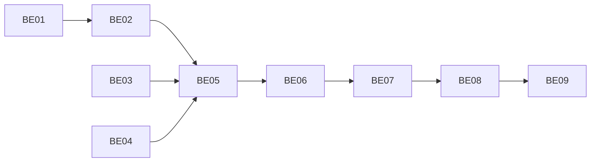

# 前端接入后端补齐任务

方案：[backend-frontend-support-design.md](backend-frontend-support-design.md)。状态：BE01–BE05 已实施，类型检查与 19 项本地测试通过；BE06–BE09 按用户要求暂缓，前后端均不实施真实 Topic 对话；BE10/BE11 仍为后续项。

## P0：前端文字 MVP 前置

### BE01 Record 归属批量读取

- 增加按当前页 recordIds 和 userId 查询 Topic 关联的方法，按记录分组去重。
- GET /api/records 追加 topics:[{id,title,status}]，分页仍先查 Record。
- 验收：零关联、多关联、重复关联、其他用户 Topic、归档 Topic 均正确；查询次数与记录条数无关。

### BE02 Record 单条详情

- 新增 GET /api/records/:id，复用 BE01 读模型；用户不匹配和不存在返回 404。
- 保持 POST/PATCH 返回原有 Record，文档注明读模型差异。
- 验收：返回完整 content、extData 和当前 topics，编辑前后可重新读取，/batch 路由不冲突。

### BE03 Topic 游标与列表契约

- 实现 updatedAt/id 复合游标、limit+1、参数校验和旧游标兼容。
- 保留 active 过滤，更新 docs 中过期描述。
- 验收：同时间跨页、恰好满页、空页、非法 cursor/limit、用户隔离；并发更新不宣称快照保证。

### BE04 详情及消息归属校验

- Topic 详情、Message 查询增加用户与 Topic/session 校验；规范开发身份来源。
- 更新 HTTP 示例和 shared DTO，避免将事件类型当消息角色。
- 验收：跨用户不可读；已有 default-user 调用兼容；错误响应一致。

### BE05 P0 联调交付

- 更新 HTTP/架构文档及 AGENTS.md，前端方案引用新的读契约。
- 运行类型检查、分页/详情/归属测试，不运行真实模型。
- 验收：前端 F02 可完成，记录到话题与话题到原文双向读取成立。

## P1：真实 Topic 对话前置

### BE06 对话请求校验与会话单飞

- 注入 TopicRepository，校验 user/session/Topic；归档拒绝新对话。
- 初始化与运行状态统一防并发，同 session 忙时返回 409；所有异常路径释放。
- 验收：并发初始化只创建一个运行时，跨 Topic session 被拒绝，失败后可再次请求。

### BE07 Topic 上下文与历史恢复

- 基于当前安装 SDK 的事件定义实现完整消息投影与恢复 fixture。
- 初始化恢复历史，每轮刷新 Topic 上下文；设置输入预算，完整轮次截断。
- 验收：重启恢复历史不重复 delta，更新 Topic 后缓存会话读取最新正文，坏事件可定位。

### BE08 消息顺序落库与 SSE 结束

- 引入顺序持久化链和 flush，done 在落库成功后发送。
- 同时处理模型错误、数据库错误、客户端断开和监听清理。
- 验收：持久化失败只有 error，没有成功 done；同时间事件顺序稳定；完成后历史可读。

### BE09 P1 契约与联调

- 提供真实结构的脱敏事件样例，更新前端 P1 适配约定和 curl 文档。
- 类型检查、事件投影、会话锁、异常持久化和重启恢复测试通过。
- 验收：前端 F09 前置满足；不添加自动沉淀、反馈或未实现的 Agent 工具能力。

## 后续项（明确不纳入默认执行范围）

### BE10 正式认证

多用户发布前单独实施：服务端认证凭证、统一身份上下文、替换可伪造 userId、归属回归。需确定微信应用及部署配置后制定细化方案。

### BE11 异步整理

需要后台恢复时单独实施：立即返回 taskId、幂等提交、原子领取、后台执行和崩溃恢复。维持旧同步接口兼容，不把 in-process Promise 等同于可靠队列。

## 执行顺序

建议先执行 BE01–BE05，支撑文字 MVP；再执行 BE06–BE09，开放对话。BE10/BE11 不因为列入文档就自动扩展本轮范围。
