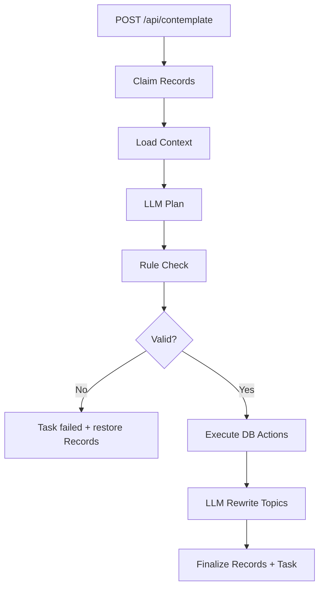

# Contemplate 简化工作流设计方案

历史首版方案。当前 v2.1 的动作协议、有限修正和验收标准以 [验证说明](../test/contemplate-v2.1-validation.md) 和 apps/server/src/agent/workflows/contemplate/prompts.ts 为准：skip_record 已统一为 recordIds 数组，规划错误共用一次修正机会。

## 一、目标

当前 MVP 已经跑通 Record → Topic 的基础链路，但效果偏向“每条 Record 生成一篇小文章”，导致 Topic 粒度过细。

本轮优化目标不是把工作流做复杂，而是先用最小改动验证一个核心假设：

> Topic 应该是长期关切，不是单条观点；Record 应被吸收到长期 Topic 的 Facet 中。

因此采用简化方案：

- 不再让 Agent 自主调用多个工具完成全链路；
- 由代码控制流程和数据库写入；
- LLM 只做两件事：生成整理计划、重写 Topic 内容；
- 先不引入独立 Point/Facet 表；
- 先不做多轮 Plan 修正；
- 先不做复杂全局 Topic 重整，只支持必要的 Topic 合并动作。

## 二、目录结构

新增目录统一放在：

```text
apps/server/src/agent/workflows/contemplate/
├── contemplate.workflow.ts
├── context-loader.ts
├── planner.ts
├── plan-validator.ts
├── executor.ts
├── topic-rewriter.ts
├── schemas.ts
└── prompts.ts
```

## 三、简化后的整体流程



| 阶段 | 执行方 | 作用 |
|---|---|---|
| Claim Records | 代码 | 领取 `pending/updated/skipped` Records，标记 `processing` |
| Load Context | 代码 | 加载本批 Records、候选 Topics、关联 Records |
| LLM Plan | LLM | 判断 Record 应进入哪个 Topic、是否新建、是否合并 Topic |
| Rule Check | 代码 | 拦截明显错误计划 |
| Execute DB Actions | 代码 | 创建、合并 Topic，写 RecordTopic |
| Rewrite Topics | LLM + 代码 | LLM 生成内容，代码写入 Topic |

首版不做独立 Extract Points、Boundary Review、Plan Revise。它们都合并进一次 Plan Prompt，先验证 prompt 约束是否能显著改善 Topic 粒度。

## 四、核心判断方法

### 4.1 Topic 定义

Topic 是：

> 用户在较长时间内可能反复进入的一个问题、方向、项目、关系或持续处境。

Topic 不是：

- 一条 Record 的标题；
- 一条观点的扩写；
- 一个关键词分类；
- 一篇自动生成文章。

### 4.2 合并判断

不要问：

```text
这条 Record 和 Topic 像不像？
```

要问：

```text
这条 Record 是否能推进这个 Topic？
```

判断标准：

- 是否服务同一个长期问题；
- 是否会在同一次阅读或决策中被一起使用；
- 是否能给 Topic 增加新观点、方法、例证、修正或问题；
- 是否只是已有 Topic 的一个 Facet。

### 4.3 新建 Topic 门槛

只有同时满足以下条件才新建 Topic：

- 它是长期问题、方向、项目或持续处境；
- 未来大概率会继续积累相关 Records；
- 无法自然进入已有 Topic；
- 不是已有 Topic 的一个 Facet；
- 当前 Record 足以描述这个 Topic 的基本边界。

默认优先级：

```text
merge_record > merge_topic > skip_record > create_topic
```

## 五、Plan 输出结构

首版 Plan 不单独输出 Point 列表，而是在每个 action 中写清楚 Record 的核心 Point 和长期关切。

```ts
type ContemplatePlan = {
  actions: Array<
    | {
        id: string
        type: "merge_record"
        recordIds: string[]
        targetTopicId: string
        facet: string
        point: string
        reason: string
      }
    | {
        id: string
        type: "create_topic"
        recordIds: string[]
        title: string
        boundary: string
        point: string
        reason: string
      }
    | {
        id: string
        type: "merge_topic"
        targetTopicId: string
        sourceTopicIds: string[]
        newTitle?: string
        reason: string
      }
    | {
        id: string
        type: "skip_record"
        recordId: string
        reason: string
      }
  >
}
```

首版暂不支持：

- `rename_topic` 独立动作；
- `restructure_topic` 独立动作；
- 多轮 revise plan；
- Topic 版本历史。

标题过窄的问题可以通过 `merge_topic.newTitle` 或 rewrite 阶段顺带处理。

## 六、核心 Prompt

### 6.1 Plan Prompt

用途：

> 输入本批 Records、候选 Topics 和关联 Records，输出 `ContemplatePlan` JSON。

Prompt 草案：

```text
你是 Fanto 的碎片知识整理规划器。你的任务不是把每条 Record 写成一篇 Topic 文章，而是判断这些 Record 正在推进用户的哪个长期关切。

核心定义：
- Record 是用户某个时刻的原始表达。
- Point 是 Record 中真正有价值的观点、问题、经验、方法、例证或假设。
- Facet 是 Topic 内部的一个方面。
- Topic 是用户未来可能反复进入的长期问题、方向、项目、关系或处境。

重要原则：
1. Topic 不是单条观点，不是 Record 的扩写，不是关键词分类。
2. 如果 Record 可以作为已有 Topic 的一个 Facet，优先 merge_record。
3. 如果两个已有 Topic 实际服务同一个长期关切，优先 merge_topic。
4. 只有当 Record 无法进入已有 Topic，且它本身定义了可长期生长的问题域时，才 create_topic。
5. 信息量不足、临时、没有沉淀价值的 Record，使用 skip_record。
6. 错误合并比暂时不合并更糟；但过早新建 Topic 会导致知识系统碎片化。
7. 不要因为标题、关键词、标签不同就拆成多个 Topic。判断它们未来是否应该共享同一份上下文。

共同推进测试：
对每条 Record 和候选 Topic，依次判断：
- 是否围绕同一个长期问题？
- 用户未来是否可能在同一次阅读、思考或决策中同时需要它们？
- Record 是否能为 Topic 增加新观点、方法、例证、修正、冲突或问题？
- 它是已有 Topic 的 Facet，还是必须成为新 Topic？

输出要求：
- 只输出 JSON，不要输出 Markdown，不要解释。
- 每条输入 Record 必须被一个 action 覆盖。
- merge_record 必须包含 recordIds、targetTopicId、facet、point、reason。
- create_topic 必须包含 recordIds、title、boundary、point、reason。
- merge_topic 必须包含 targetTopicId、sourceTopicIds、reason，可选 newTitle。
- skip_record 必须包含 recordId、reason。
- 不允许编造 recordId 或 topicId。
- reason 必须具体说明为什么这样归属，而不是泛泛说“语义相关”。

输入数据：

当前时间：
{{currentTime}}

待处理 Records：
{{records}}

候选 Topics：
{{topics}}

候选 Topic 的关联 Records：
{{relatedRecords}}

请输出 JSON，格式如下：
{
  "actions": [
    {
      "id": "action-1",
      "type": "merge_record",
      "recordIds": ["..."],
      "targetTopicId": "...",
      "facet": "...",
      "point": "...",
      "reason": "..."
    }
  ]
}
```

### 6.2 Rewrite Prompt

用途：

> 对每个受影响 Topic，结合本轮 actions、Records、source Topics，生成新的 `title/summary/tags/content`。

Prompt 草案：

```text
你是 Fanto 的 Topic 内容整理器。你的任务是把新 Record 吸收到一个长期 Topic 中，让 Topic 更清晰、更有结构，而不是把 Record 简单扩写或追加。

Topic 定义：
Topic 是用户未来会反复进入的长期问题域。它应该容纳多个 Facet，而不是只表达一条观点。

写作原则：
1. 保留用户明确表达的判断，不要把它改写成客观事实。
2. 对 Fanto 的推断要明确表达为“可能”“可以理解为”“当前看起来”。
3. 不要过度扩写，不要写空泛套话。
4. 不要按 Record 顺序堆叠内容，要按 Facet 重组。
5. 如果新内容只是例证或方法，把它放到合适的小节中。
6. 如果新内容修正了旧判断，更新原判断，并保留必要的不确定性。
7. 如果多个 source Topic 被合并，删除重复表达，保留真正不同的 Facet。
8. content 使用 Markdown，但不要为了显得完整而制造没有依据的章节。

输入数据：

目标 Topic：
{{targetTopic}}

本次需要吸收的 Records：
{{records}}

本次执行的 Actions：
{{actions}}

被合并的 source Topics：
{{sourceTopics}}

目标 Topic 已关联的历史 Records 摘要：
{{relatedRecords}}

输出要求：
- 只输出 JSON，不要输出额外解释。
- title 应是长期问题域标题，不要贴着单条 Record。
- summary 用 1 到 2 句话说明这个 Topic 的长期关注点。
- tags 保持 3 到 6 个。
- content 是完整 Markdown 正文。
- content 必须区分“用户明确判断”“Fanto 的整理理解”“仍需验证/继续探索的问题”。

输出 JSON 格式：
{
  "title": "...",
  "summary": "...",
  "tags": ["..."],
  "content": "..."
}
```

## 七、代码规则校验

首版只做必要校验，避免工作流过重。

必须校验：

- action 引用的 recordId/topicId 存在；
- 每条 claimed Record 被覆盖；
- `merge_record` 的 targetTopicId 是 active Topic；
- `create_topic` 有 boundary；
- `merge_topic` 的 sourceTopicIds 不包含 targetTopicId；
- 同一个 source Topic 不被多个 `merge_topic` 消费；
- 每条 Record 自动关联不超过 2 个 Topic；
- 本轮新建 Topic 数量不能超过 claimed Record 数量，且超过 1 个时打 warn 日志。

首版不做：

- LLM plan 自动 revise；
- 复杂语义二次审查；
- Topic 内容质量自动打分。

## 八、执行规则

执行顺序：

```text
merge_topic → create_topic → merge_record → skip_record → rewrite_topic → finalize
```

### 8.1 merge_topic

- 选择 target Topic 作为主 Topic；
- 将 source Topic 的 RecordTopic 迁移到 target Topic；
- source Topic 标记为 `archived`；
- target Topic 加入 rewrite 列表；
- source Topic 加入 rewrite 输入。

### 8.2 create_topic

- 创建 Topic；
- `sessionId` 使用 `topic:<topicId>`；
- 写入 RecordTopic；
- 新 Topic 加入 rewrite 列表。

### 8.3 merge_record

- 写入 RecordTopic；
- target Topic 加入 rewrite 列表。

### 8.4 skip_record

- Record 后续标记为 `skipped`；
- reason 写入 Task result。

### 8.5 rewrite_topic

- 对每个受影响 Topic 调用 Rewrite Prompt；
- 写入 `title/summary/tags/content`；
- 重建该 Topic 向量。

### 8.6 finalize

- 成功关联的 Record 标记为 `organized`；
- skip 的 Record 标记为 `skipped`；
- Task 标记为 `completed`；
- 失败时 Task 标记为 `failed`，并恢复本次 claimed Records 原状态。

## 九、Task Result

首版保存足够排查问题的信息：

```json
{
  "workflowVersion": "contemplate-workflow-v2-simple",
  "context": {
    "recordCount": 0,
    "candidateTopicCount": 0
  },
  "plan": {
    "actions": []
  },
  "validation": {
    "passed": true,
    "violations": []
  },
  "execution": {
    "actions": {}
  },
  "rewrites": {},
  "skipped": []
}
```

## 十、当前测试数据验收标准

用当前 6 条 Records 验证时，合理结果应收敛为 2 个 Topic：

### Topic A：AI Native 工程师的能力与协作实践

包含：

- AI Coding 执行偏差；
- 多轮澄清、上下文完整、根因确认；
- Mermaid 文档约束、git worktree 隔离；
- 工程师能力从写代码转向驾驭 AI 工作流。

### Topic B：Fanto 的碎片沉淀机制

包含：

- 碎片记录工具重点不是分类，而是自然形成长期话题；
- AI 整理记录时应保守合并；
- 同时避免过早新建 Topic 导致碎片化。

不应出现：

- 每条 Record 一个 Topic；
- Topic 标题完全贴着单条观点；
- content 只是把用户原文扩写变长；
- 用户假设被写成客观事实。

## 十一、后续再优化项

只有当简化版测试仍存在问题，再逐步增加：

- 独立 Extract Points step；
- Boundary Review step；
- Plan revise step；
- Topic 内容质量评分；
- Point / Facet 独立表；
- Topic 版本历史；
- processing 超时自动补偿。
