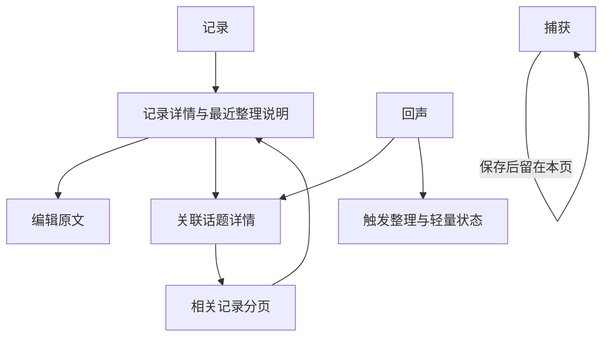
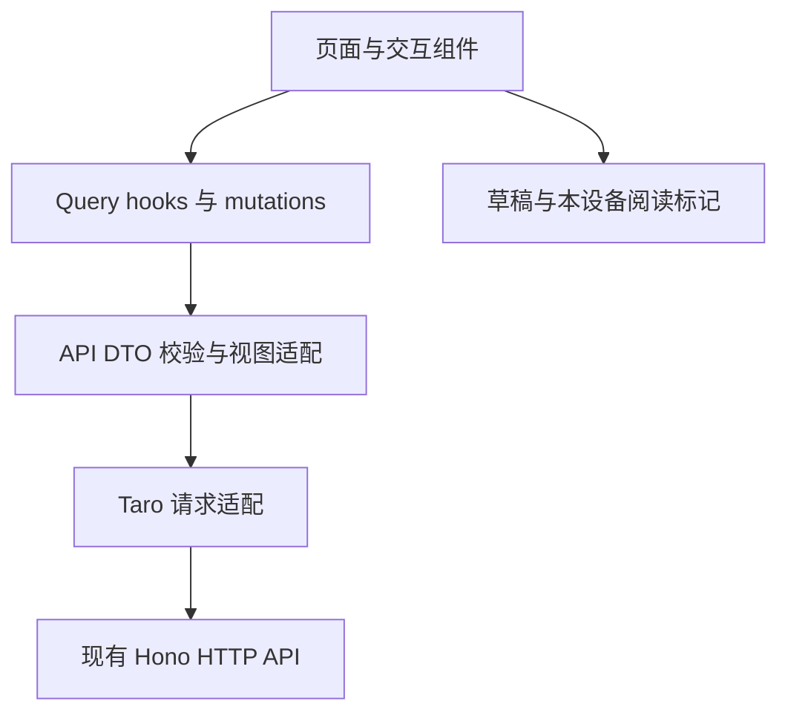

# Eiko 前端 MVP 工程方案

日期：2026-09-05。状态：H5 MVP 已实施；P0 后端读接口已完成，小程序待适配。

当前交付方向：H5 优先实现和验收，小程序后续适配；真实 Topic 对话前后端均暂缓，不纳入本轮或自动延续为下一阶段。后端当前契约以 docs/api/http-api.md 为准。

配套任务：[frontend-mvp-tasks.md](frontend-mvp-tasks.md)。产品原型：[product-interactive-demo.html](../docs/frontend/product-interactive-demo.html)。当前接口：[http-api.md](../docs/api/http-api.md)。

本方案替代旧 plan/03-frontend-engineering.md 中“完整复刻所有 Demo 行为”的要求。保留三入口与阅读氛围，以后端真实能力决定交互。旧 docs/frontend/design.md 中的关联读模型、历史消息和自动整理描述以本方案为准。

## 1. 目标与交付范围

首版交付可通过浏览器访问的 H5 应用，沿用 Taro + React + TypeScript。优先完成桌面浏览器和移动端浏览器的真实业务闭环，不依赖微信开发者工具、appid 或微信登录。保留跨端组件与适配边界，小程序放在后续阶段单独验收。

用户闭环：随手记下原文，保存后继续记录；查看记录及最近整理理由；主动发起一轮整理；阅读长期话题及最新变化；回到原始记录修改，再次整理。

| 范围 | 决定 |
|---|---|
| P0 | 文字捕获、记录分页、决策摘要、原文编辑、回声列表、详情、关联记录、轻量整理触发 |
| 后续 | 微信小程序构建与真机适配；不自动包含真实对话 |
| 不实现 | 反馈入口、点赞点踩、Record tag、标签管理、语音/录音/ASR、研究任务、对话候选自动沉淀、离线自动上传 |

修改原文不等同于纠正 AI 的反馈；界面不得暗示它会直接设置归属。Topic tags 原样展示少量条目，不提供缺乏后端支持的筛选功能。

## 2. 真实工程与接口边界

apps/frontend 只有 package.json 和 tsconfig.json，没有页面、Taro 依赖和构建脚本。shared 已提供 api/dto.ts：RecordReadDto 含 content/topics，RecordDto 用于创建/修改结果；View 类型仍需显式适配，不能直接断言响应。

| 能力 | 当前情况 | 前端处理与依赖 |
|---|---|---|
| Record 创建/批量创建/PATCH | 已实现；PATCH 后 updated，processing 返回 409 | P0 使用单条创建和 PATCH；批量录入仅测试工具使用 |
| Record 列表/topicId 过滤 | 已实现复合游标 | useInfiniteQuery；不根据 total=0 判断空列表 |
| Record 最近摘要 | extData.organization 已实现 | null/未知结构安全降级；updated 时显示“上次整理” |
| Record -> Topic | 列表和 GET /api/records/:id 已返回 topics | 直接用于详情与归属跳转；POST/PATCH 不含 topics，成功后刷新读缓存 |
| Topic -> Records | GET /api/records?topicId 已实现 | 独立分页加载，不从 Topic 详情臆造 relatedRecords |
| Topic 最新变化 | extData.organization 已实现 | 展示最近一次成功变化，不当作变化历史 |
| Topic 列表 | 仅查 active，updatedAt/id 复合游标 | 使用返回 cursor，末页 hasMore=false |
| 自动整理 | organizer-trigger.ts 仍是 TODO | P0 明确提供“整理”操作，不承诺后台定时生效 |
| 整理 HTTP | 同步等待，结束才返回 taskId | 等待期间可切页；不把超时当作服务端已失败 |
| 流式对话 | 存在初步路由，真实上下文和恢复未完成 | 本轮不实现前后端对话，不显示入口 |
| Message 查询 | topicId 查询，role 实际为事件类型、payload 为序列化事件 | 需要事件归约，不能逐条渲染为聊天气泡 |

现有 Record/Topic 详情及消息读取已补用户隔离；开发 x-user-id 不是身份认证。P0 用固定开发用户联调；真实多用户发布前补正式认证，不在前端存储或下发模型密钥。

## 3. 信息架构与 Demo 调整



### 捕获

文本输入成为主入口，支持多行。隐藏 Demo 的录音按钮、计时、波形及“已保存录音和转写”，不以模拟功能占据主屏。

点击提交后禁用重复提交，成功才清空本次提交的内容，显示“已记录”并留在捕获页。等待时可继续编辑：若内容已经变化，只清理已提交快照，不覆盖新草稿。失败保留输入；网络超时提示“未确认是否保存”，提供查看记录入口，不自动重发非幂等创建请求。

草稿按开发用户保存在本地，键盘收起或切换入口不丢失。提交不立即生成或打开回声，不等待向量化。

### 记录

倒序列表以原文为主体，时间与状态为辅助。内容过长折叠，点击进入 Record 详情页。详情页是原文阅读和编辑的稳定入口，避免多个 Sheet 叠加。

| 状态 | 文案与行为 |
|---|---|
| pending | 待整理 |
| processing | 整理中；编辑禁用，服务端 409 仍需处理 |
| organized | 已整理；有 topics 时展示可点击标题 |
| skipped | 暂未归入话题；原文保留 |
| updated | 内容已修改，待重新整理；旧摘要标明“上次整理” |

列表下方显示一行结果，例如“已补充到 AI 协作实践”；只有真实 topics 数据才能生成跳转。摘要不是当前关联的权威来源。

记录详情可展开“整理说明”：action 对应用户文案、reason、organizedAt。taskId 仅用于内部关联，不向用户展示工作流术语、模型原始输出或 confidence。

没有摘要的历史记录显示“暂无整理说明”，不能根据状态自动编写原因。失败任务不会把 Record 永久标成失败，故不能仅靠 pending 推断失败，任务级错误放在整理入口。

编辑页只修改 content。成功提示“已保存，待重新整理”，保留原创建时间；409 保留编辑草稿并提示“正在整理，请稍后再试”。无修改不发送请求。没有反馈按钮或归属选择器。

### 回声列表

一个 Topic 对应一个列表项，长期问题标题为主体，summary 为辅助。本次变化来自 extData.organization.summary，例如“补充验收方法，并修正了约束遗漏的归因”。

不继续展示 Demo 的“我替你多想了 N 步”，也不把 Topic 正文改造成没有依据的强断言标题。tags 保持现状，小字体显示最多三个，溢出在详情查看。

organization.recordIds.length 只能称“本次涉及 N 条记录”，不能称“新增 N 条”或“共 N 条”。数组为空时仍可展示变化说明。旧数据无 organization 则只显示 Topic summary 和更新时间。

本地记录每个 Topic 已阅读的 organization.taskId；taskId 变化显示未读点。仅表示本设备未读，不做跨设备承诺，也不把过去几次更新拼成伪造的完整历史。

### 回声详情

顺序：标题与整体摘要 -> 最近一次变化（有则显示）-> Markdown 正文 -> 相关记录分页。页头提供“相关记录”定位入口，避免用户必须读到底才能溯源。

相关记录必须调用 GET /api/records?topicId，展示真实原文、创建时间，可进入 Record 详情。最新变化中的 recordIds 仅用于标记已加载的相关记录属于本次处理，不能假设这些记录在第一页。

支持“加载更多”，不自动下载所有历史记录。暂不做每一句正文到原文的精确引用，当前只有 Topic 级关联，没有句级证据映射。

归档详情允许只读展示“该话题已归档”；没有可靠目标 ID 时不猜测跳转到哪个合并 Topic。404 提供返回列表。

## 4. 工程架构



| 层 | 选型与约束 |
|---|---|
| 页面 | Taro + React + TypeScript，沿用现有 monorepo |
| 样式 | SCSS Modules、统一 Design Tokens，不先引入大型组件库 |
| 服务端数据 | TanStack Query，负责分页、刷新、mutation 后失效 |
| 短期交互 | React state/context；首版不额外引入 Zustand |
| 本地持久化 | Taro storage，存草稿和阅读标记，不落完整敏感任务结果 |
| 网络 | 普通请求统一 Taro.request；H5 开发使用同源代理，本轮不建设 SSE 客户端 |
| Markdown | H5 使用 markdown-it 解析、DOMPurify 清洗；小程序阶段增加跨端 Renderer，不手写 Markdown 解析器 |
| 校验 | DTO 与 extData.organization 边界校验；遇到未知扩展键忽略并保留原值 |

H5 实施时验证 Taro.request 的浏览器行为，参考 [Taro.request](https://docs.taro.zone/en/docs/apis/network/request/)。不为了暂缓的对话提前建设分块接收或 SSE 适配。

H5 将浏览器可见性和网络变化接入 Query；页面显示时按需刷新。平台相关监听收敛在适配层，后续小程序通过生命周期替换，不在业务组件散布 window/wx 判断。参考 [TanStack FocusManager](https://tanstack.com/query/v4/docs/reference/focusManager)。实施时统一锁定兼容依赖版本，不照抄旧方案版本占位符。

```text
apps/frontend/
  config/                       # 构建、开发/生产 API 地址
  src/
    app.tsx / app.config.ts / app.scss
    pages/
      capture/ records/ record-detail/ record-edit/
      topics/ topic-detail/
    features/
      capture/                  # 表单与草稿
      records/                  # 列表、摘要、编辑、query hooks
      topics/                   # 列表、变化说明、相关记录
      organization/             # 手动触发、等待与刷新
    services/
      request.ts api.ts query-keys.ts dto.ts adapters.ts
      platform.ts               # 页面可见性、网络与平台差异
    components/
      ui/ markdown/
    theme/                      # 色彩、字号、间距、动效
    storage/                    # 草稿、阅读标记
    fixtures/                   # 与真实 DTO 一致的本地测试数据
```

复用 packages/shared 已有 API DTO；保留 View 与适配函数区分，不将 API.content 偷换为 text。本轮不消费消息事件，不引入 pi SDK。

## 5. 缓存、刷新与整理触发

Query key 均包含 userId。记录列表 key 包含 topicId 或 all；详情按实体 ID；messages 按 topicId。请求层统一处理非 2xx、success=false、非法响应和断网。

创建/PATCH 成功后合并实际响应到已有记录缓存并失效记录列表。PATCH 不立刻修改 Topic 正文。整理完成后失效 records、topics、当前详情及相关记录缓存，保留滚动位置，使用刷新提示避免阅读时强制跳顶。

列表按 ID 去重；Records 和 Topics 都使用返回的复合 cursor。分页期间更新可导致排序变化，刷新时重新从第一页加载。total=0 不显示为“0 条”，无精确计数时不展示总量。

P0 在回声页工具区提供一个“整理”命令，执行中防重复点击，用户仍能去捕获页记录。默认不自动连续发起任务，也不在每次打开页面时发起整理。每批最多 30 条且 skipped 会重入，不能自动循环到“没有待处理”为止。

同步 POST 正常结束后用 taskId 查询完成情况或直接刷新。任务列表只在用户主动查看进展/重新进入页面时辅助恢复；没有运行标识不能保证最新任务就是本次请求，不能无条件绑定。

网络超时或进入后台导致请求中断：标记“结果待确认”，刷新记录/话题并允许查看最新整理状态，不自动重试 POST、不宣称任务取消。P0 接受这一限制；要支持可靠后台恢复，后续后端需异步触发返回 taskId，再轮询该 ID。

阅读状态刷新采用页面 onShow 和手动下拉；明确有进行中任务时短时轮询（例如 3 秒，前台最多 2 分钟），停止时保留待确认状态，不变成失败。后台暂停轮询，清理定时器。

## 6. 最小后端前置与后续边界

当前后端依赖状态如下，H5 文字 MVP 无需等待对话或正式认证开发：

| 编号 | 优先级 | 精确改动与理由 |
|---|---|---|
| B1 | 已完成 | Record 列表含 topics，详情独立可读，当前页关联批量查询 |
| B2 | 已完成 | Topic updatedAt/id 复合游标与参数校验 |
| B3 | 暂缓 | 真实 Topic 对话前后端均不实施，不作为当前验收条件 |
| B4 | 多用户发布前 | 完整认证及详情/消息用户隔离；当前固定开发用户不能作为上线认证 |
| B5 | 后续可靠后台整理 | 异步创建任务并立刻返回 taskId，或完成真实调度；首版暂不依赖 |

B1/B2 直接联调现有接口。不得扫描所有 Topic 的记录反推归属，也不得将 tasks.result 中的历史计划当作当前关联。

## 7. 启动、访问与构建

以下脚本已经实现，可直接运行。

| 根目录命令 | 行为 | 当前状态 |
|---|---|---|
| pnpm dev | 启动现有后端，默认 3000 | 已存在，保持语义不变 |
| pnpm dev:h5 | 启动 Taro H5 开发服务 | 已实现 |
| pnpm build:h5 | 构建 H5 静态产物到 apps/frontend/dist/h5 | 已实现 |
| pnpm dev:weapp / build:weapp | 小程序编译/监听 | 后续小程序阶段配置验收 |

apps/frontend 提供同名脚本，根目录通过 pnpm --filter @eiko/frontend 转发。现有 dev:frontend 不再指向未实现的小程序启动入口，应调整为 H5 开发命令的别名。

实现后在两个终端分别启动：

```bash
# 终端一，项目根目录
pnpm dev
```

```bash
# 终端二，项目根目录
pnpm dev:h5
```

H5 期望使用独立端口（例如 5173），实际地址以开发服务器打印的 URL 为准。端口占用时选择其他可用端口并明确输出。用户打开浏览器 URL 即可使用，不需要微信开发者工具。

H5 开发请求统一使用相对 /api 路径；开发服务器将 /api 和 /health 代理到 http://127.0.0.1:3000，不重写业务路径。API 目标可配置；整理请求的代理超时需与客户端长请求一致，不能使用过短默认值。超时仍按“结果待确认”处理，不自动重发。

使用 hash 路由作为首版默认，避免静态部署的深链接刷新依赖服务端回退配置。验收列表/详情刷新、浏览器后退和参数恢复；详情必须按 ID 从 API 重新加载，不依赖上页内存数据。

H5 构建产物与小程序产物使用分开的目录，例如 dist/h5 与 dist/weapp。H5 正式访问需要静态托管加同源 /api 反向代理，开发代理不会打包进产物；不能直接双击 HTML 文件使用 API。部署方案不包含在当前实现任务中，但启动说明必须解释这一点。

手机浏览器联调时，H5 服务监听可访问的局域网地址，通过电脑 IP 打开 H5；浏览器仍请求同源 /api，由电脑开发服务器访问后端。127.0.0.1 在手机上指向手机本身，不硬编码为前端 API 地址。

本轮不创建 chat/、SSE 客户端或“继续讨论”入口。真实对话恢复开发时重新确认范围，不随小程序适配自动开启。

## 8. 视觉与内容约束

保留 Demo 的克制排版、三入口、原文时间线和可收起详情，不复制手机壳、模拟系统状态栏或固定 410x860 尺寸。H5 采用移动优先响应式布局：手机底部导航，宽屏使用受约束的阅读宽度与持续可见导航，不能只是把整个手机截图放大。正文长词、代码块和长标题不得溢出，不按视口线性放大字号。

页面是连续布局，卡片只用于重复记录/话题，避免卡片套卡片；工具使用清晰图标并提供无障碍标签。复用统一图标资源，不逐页手写 SVG。固定工具尺寸，点击/加载状态不能引起跳动。

Markdown 支持标题、段落、列表、引用、加粗、链接、代码块与表格；代码和表格允许横向滚动。禁用原始 HTML 和危险链接协议；远程图片不默认自动拉取，暂不支持语法展示可读占位，不能导致整页失败。

不强制 Topic 正文重排为“用户判断/推断/问题”三类章节，展示后端真实 Markdown。界面只补来源与本次变化说明，不再让前端调用模型扩写。

## 9. 验收与发布边界

测试包括：草稿保存失败不丢失、发送期间继续输入不被清空、重复提交阻止、Record 同时间游标、组织摘要 null/旧值、编辑 409、Topic 移出归档、最新变化 recordIds 为空、任务超时待确认、长文本布局。

采用组件与纯函数测试验证 DTO 映射和缓存更新；H5 是本轮正式验收目标。用 Playwright 在桌面与移动视口验证闭环、截图、页面刷新和返回，并在手机浏览器检查键盘与滚动。小程序编译及真机测试属于后续验收，不阻塞 H5 交付。

开发者工具可连接开发服务；真机需要可访问的服务地址，不能使用手机上的 127.0.0.1 指代电脑。生产接口使用平台允许的域名配置；API 地址进入构建环境配置，模型凭据永不进入前端。

首轮 H5 验收：创建 -> 解释 -> 手动整理 -> 最新变化 -> 相关原文 -> 修改 -> 再整理，全链路使用真实 API。后续小程序阶段只复验该文字闭环和平台差异，不自动增加对话。所有 Mock 必须显式启用，不能在真实接口失败时静默切回 Demo 内容。
