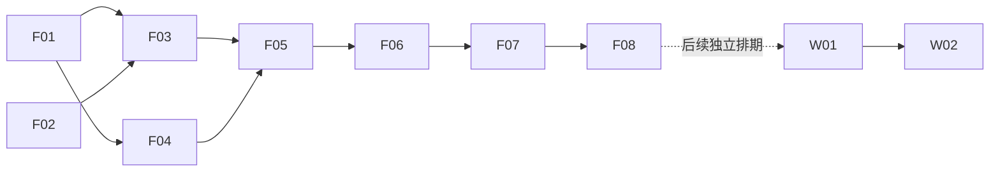

# Fanto 前端 MVP 实施任务

对应方案：[frontend-mvp-design.md](frontend-mvp-design.md)。交付目标：浏览器 H5 优先，小程序后续适配；F01-F08 已完成实现与隔离验证。

后端读接口、Topic 复合游标和 shared DTO 已完成。真实 Topic 对话前后端移出当前实施清单，不随下一阶段自动恢复。

## 阶段一：H5 文字记录与整理闭环

### F01 工程与平台验证

- 在 apps/frontend 初始化 Taro React TS H5 工程，补 dev:h5、build:h5、typecheck、test 脚本及开发配置；根目录增加同名转发，dev:frontend 改为 H5 别名，pnpm dev 仍只启动后端。
- 统一依赖版本与 lockfile；验证 Query 生命周期适配、基础网络请求、Taro 页面切换。
- 配置 H5 端口、hash 路由、/api 与 /health 开发代理和固定开发用户，生产不内嵌模型密钥。
- 验收：H5 构建及类型检查通过，浏览器可打开开发地址并请求后端 /health，路由刷新不丢页面；无需微信开发者工具。

### F02 接入已完成的后端读契约

- 复用现有 Record 列表/详情的 topics、extData 及 Topic 复合游标，核对真实返回样例。
- 使用 shared DTO，明确 API content 与 View text 区别；POST/PATCH 基础响应不覆盖缓存中的 topics。
- 验收：前端适配与当前接口一致。后端 B1/B2 已完成，不重复开发。

### F03 请求层与读模型

- 实现普通请求解包、边界校验、query keys、分页 hooks、extData.organization 适配。
- 明确不透明游标与 pageSize/hasMore；不使用占位 total 计数。
- 准备与真实响应一致的显式 fixtures，不使用 Demo 自定义 finding 对象作为 API。
- 验收：null 摘要、未知扩展键、失败响应、空页和跨页重复测试通过。

### F04 基础布局与捕获

- 移动优先 H5 三入口导航、宽屏阅读布局、字体与间距 Tokens、多行捕获输入、用户草稿存储。
- 保存成功后留页提示“已记录”，不自动打开回声；失败保留内容。
- 隐藏无后端能力的录音、ASR、研究入口。
- 验收：提交期间继续输入不丢新草稿，快速连点不重复提交，超时不自动重发。

### F05 记录列表、详情、编辑

- 按创建时间倒序分页，展示原文、状态、真实 Topic 链接和最近整理说明。
- 独立 Record 详情/编辑页面；PATCH 保存后刷新对应缓存。
- updated/processing 显示上次摘要；处理 404、409 和原文未变化。
- 验收：由记录进入话题并返回保持位置，草稿在 409 后保留，历史无摘要不造解释。

### F06 回声列表、详情、溯源

- 列表显示长期标题、summary、真实最新变化与本设备未读点。
- Markdown 渲染、相关记录独立分页、跳转原文、归档状态。
- 本次 recordIds 不当作总量或新增数；不假设在相关记录第一页出现。
- 验收：既有 4 个话题能正确展示，正文和原文可往返，长标题/表格/代码块布局正常。

### F07 手动整理与状态同步

- 回声工具区提供整理操作，一次一批；请求等待不锁死其他页面。
- 正常完成刷新相关缓存；超时显示结果待确认，结合任务列表辅助检查但不猜测对应 taskId。
- 页面恢复/下拉刷新；短时轮询仅在前台明确等待任务时运行。
- 验收：记录保存后不假装已整理；重复点击拦截；后台切回可刷新结果；无自动 POST 重试或循环消费 skipped。

### F08 H5 联调、启动说明与验收

- 用隔离数据运行创建、整理、修改、重整、摘要覆盖、旧 Topic 更新完整链路。
- 补组件/适配/分页测试，Playwright 桌面与移动视口截图、路由刷新/返回测试，手机浏览器键盘与滚动检查。
- 更新 docs/frontend/design.md、HTTP 文档和 AGENTS.md；记录尚未实现的对话/认证能力。
- 写明两个终端分别运行 pnpm dev 与 pnpm dev:h5、浏览器访问地址、代理配置及 build:h5 产物使用方式。
- 验收：真实 API 完成 H5 闭环；无假数据兜底，无前端未处理异常，测试和构建通过。实现交付时启动 H5 开发服务并提供可访问 URL。

## 后续阶段：小程序适配（不阻塞 H5）

### W01 小程序构建与平台适配

- 增加 dev:weapp、build:weapp 和独立产物目录，配置 appid 与合法域名等运行环境。
- 替换 H5 可见性/网络事件适配，校验跨端 Markdown、导航、storage 和请求行为。
- 验收：微信开发者工具启动并读取真实数据，不影响 H5 构建。

### W02 小程序真机验收

- 在 iOS/Android 真机复验文字闭环、键盘、安全区、切后台、网络中断和整理待确认状态。
- 多用户发布前完成正式认证，异步整理另行排期。
- 不增加真实对话、反馈、录音或标签管理。验收通过后才声明小程序可用。

## 依赖关系

首轮只执行 F01–F08，交付可从浏览器访问的 H5 MVP；W01/W02 后续排期。真实对话不在任务清单内。每项提交应带验证结果；执行期间发现接口不符，修正文档和契约后再继续，不靠前端猜测补齐数据。
