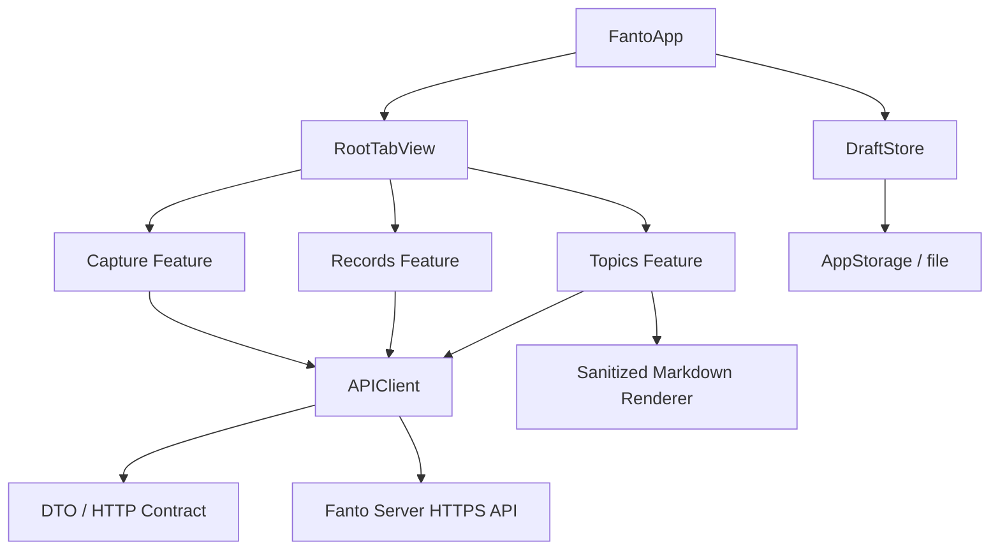
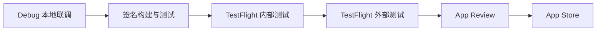

# Fanto 原生 iOS 工程方案

## 目标与范围

在保留现有 H5 的前提下，于 `apps/ios` 建立独立的 SwiftUI 工程，实现当前已验收的「捕获、记录、回声」体验。iOS 端只共享 HTTP 契约的语义，不复用 React 组件、H5 构建链路或服务端运行时。

首个版本包含：

- 捕获 Record、草稿本地保存和请求失败后的保留；
- Record 列表、详情、编辑与分页；
- Topic 列表、Markdown 详情、关联原始记录的展开与内部滚动；
- 当前状态、关联 Topic、摘要和只读的最近变化展示；
- 深链以外的常规导航、网络错误、加载、空态与无障碍支持。

首个版本不包含真实 Topic 对话、录音、反馈、标签管理、推送、离线同步或正式账号体系。这与当前 H5 和服务端的能力边界保持一致。

视觉与交互的实现依据为 [跨端 UI 指南](../docs/frontend/cross-platform-ui-guide.md)、[前端设计文档](../docs/frontend/design.md) 和 [HTTP API 文档](../docs/api/http-api.md)。

## 推荐架构

采用原生 SwiftUI + Swift Concurrency + URLSession。业务以 Feature 为边界，网络与可复用视图放入 Core；每个页面拥有可测试的 ViewModel。该选择能直接适配系统动态字体、辅助功能、安全区与底部 Tab 交互，也能在 iOS 26 上跟随系统控件的 Liquid Glass 外观。



### 工程目录

```text
apps/ios/
├── Fanto.xcodeproj/
├── Fanto/
│   ├── App/
│   │   ├── FantoApp.swift
│   │   ├── RootTabView.swift
│   │   └── AppEnvironment.swift
│   ├── Core/
│   │   ├── API/
│   │   │   ├── APIClient.swift
│   │   │   ├── Endpoint.swift
│   │   │   ├── DTO/
│   │   │   └── APIError.swift
│   │   ├── DesignSystem/
│   │   │   ├── FantoColor.swift
│   │   │   ├── FantoTypography.swift
│   │   │   ├── Components/
│   │   │   └── LiquidGlass.swift
│   │   ├── Markdown/
│   │   │   └── MarkdownRenderer.swift
│   │   ├── Persistence/
│   │   │   └── DraftStore.swift
│   │   └── Support/
│   ├── Features/
│   │   ├── Capture/
│   │   │   ├── CaptureView.swift
│   │   │   └── CaptureViewModel.swift
│   │   ├── Records/
│   │   │   ├── RecordListView.swift
│   │   │   ├── RecordDetailView.swift
│   │   │   ├── RecordEditView.swift
│   │   │   └── RecordViewModel.swift
│   │   └── Topics/
│   │       ├── TopicListView.swift
│   │       ├── TopicDetailView.swift
│   │       └── TopicViewModel.swift
│   ├── Resources/
│   │   ├── Assets.xcassets/
│   │   ├── Localizable.xcstrings
│   │   └── Config/
│   └── Preview Content/
├── FantoTests/
│   ├── APIClientTests.swift
│   ├── FeatureViewModelTests.swift
│   └── Fixtures/
├── FantoUITests/
│   ├── CaptureFlowTests.swift
│   ├── RecordFlowTests.swift
│   └── TopicFlowTests.swift
└── README.md
```

初期不引入跨平台 UI 框架、第三方状态库或本地业务数据库。草稿用轻量本地持久化；服务端仍是 Record、Topic 和整理状态的唯一业务真相。若后续出现离线编辑或复杂同步，再单独评估 SwiftData 或 SQLite。

### 配置与契约

- 以 `.xcconfig` 管理 Debug、Staging、Release 三套 `API_BASE_URL`；实际生产地址与密钥不提交到仓库。
- DTO 由 Swift `Codable` 表达，字段和分页规则严格以 HTTP 文档为准；`nextCursor` 保持不透明。
- 开发期 `x-user-id` 仅用于本地联调。发布版本必须改为服务端签发的认证凭据，不能把固定用户 ID、模型密钥或服务端密钥写入 App。
- Markdown 使用受控渲染器：首版仅支持现有正文所需的标题、段落、列表、引用、代码和表格；禁用 HTML、脚本、iframe 与远程可执行内容。

## iOS 版本与 Liquid Glass 评估

### 版本策略

建议首版部署目标为 **iOS 17+**，同时支持 iPhone 与 iPad 的自适应布局。理由是 SwiftUI 的 `NavigationStack`、`TabView`、Swift Concurrency 和动态字体已足够成熟，且可覆盖仍在使用近年设备的大部分目标用户。最低版本是产品覆盖与测试成本的选择，不应为了 Liquid Glass 将全体用户抬升到 iOS 26。

| 系统范围 | UI 策略 | 验收重点 |
|---|---|---|
| iOS 17–25 | 复原纸白背景、绿色点缀、细分隔线与浅色摘要卡片 | 三栏导航、安全区、字体放大、列表两行截断 |
| iOS 26+ | 使用系统原生 Tab、Toolbar、按钮样式的自动更新外观；对可用的新 Glass API 做条件启用 | 透明层上的文字对比度、滚动时 Tab 行为、减少动态效果 |

Apple 说明，使用 SwiftUI、UIKit 或 AppKit 的标准组件，界面会在新系统版本中采用最新的视觉语言；iOS 26 的 Liquid Glass 是动态材质，应该优先通过系统组件和官方 API 获得，而不是用自定义毛玻璃和叠加阴影模拟。[Apple：Adopting Liquid Glass](https://developer.apple.com/documentation/TechnologyOverviews/adopting-liquid-glass?changes=latest_major%2Clatest_major)

### 是否适合使用 Liquid Glass

**可以支持，但只用于系统导航与少量操作控件。** Fanto 的正文和摘要属于长阅读内容，当前的纸白、低饱和主题更有利于连续阅读；状态标签、Topic 标签、摘要卡片和 Markdown 正文不使用玻璃材质。

建议如下：

- iOS 26+：让 `TabView`、系统工具栏、系统按钮自然采用平台外观；捕获页的“记录”主操作可在设计评审后使用官方 Glass 风格。
- 全版本：内容表面继续使用 `#F7F7F4`、`#FFFFFF`、`#EEF4F0` 等现有令牌，保留清楚的边界和文字对比度。
- iOS 17–25：渲染等价的非玻璃组件，不复制折射、高光或动态形变。
- 无障碍：在“降低透明度”“增加对比度”“减少动态效果”开启时，退回为不透明表面、静态过渡和清晰边线。

这条路线能保留 Fanto 的视觉识别，同时让使用新系统的用户在底部导航、工具栏等系统区域感受到 Liquid Glass。Apple 也指出，使用旧版 Xcode 构建的应用在 iOS 26 上会保持原有 UI；因此 Liquid Glass 应作为可验证的 iOS 26+ 增强，而非上线前提。[WWDC25：Platforms State of the Union](https://developer.apple.com/videos/play/wwdc2025/102/?id=707)

## UI 实现要点

- 一级页面使用 `TabView`；捕获、记录、回声页采用等高 112pt 的吸附页头。Topic 详情保持完整 Markdown 阅读，不固定页头，也不放返回或刷新按钮。
- Record 单元严格为“原文（两行省略）→ 时间、暖色状态标签、绿色 Topic 标签”。详情页显示全文。
- Topic 详情顺序固定为标题、时间与标签、浅绿色摘要卡片、相关原始记录、最近变化、Markdown 正文；关联原始记录展开后固定约 170pt，内部滚动。
- 使用 `Dynamic Type`、`accessibilityLabel`、足够的点击区域和系统安全区 API；不以固定屏幕尺寸、手工状态栏高度或 H5 像素值布局。
- 动效限于 120–180ms 的展开、折叠、按钮反馈；“减少动态效果”时取消非必要动画。

## 构建、调试与部署

### 本地开发

1. 在 macOS 上安装稳定版 Xcode，使用 Xcode 打开 `apps/ios/Fanto.xcodeproj`；先选择 iOS Simulator 的 iPhone 与 iPad 机型。
2. 通过 `Debug.xcconfig` 指向本机后端。模拟器可使用 `http://127.0.0.1:3000`；真机必须使用局域网可访问的开发地址，或 HTTPS 测试环境。开发期可为本地 HTTP 设置受控的 ATS 例外，Release 禁止该例外。
3. 为 APIClient 和 ViewModel 编写单元测试；用 URLProtocol 或 Mock APIClient 隔离网络。UI 测试覆盖捕获、两行截断、编辑、分页、关联记录展开及 iOS 17 / iOS 26 的关键布局。
4. 每次发布候选在真机测试动态字体、深浅模式策略、网络中断、安全区、VoiceOver、降低透明度和减少动态效果。

### 测试分发与正式发布



- 真机安装、TestFlight 和 App Store 分发需要加入 Apple Developer Program；Xcode 使用 Team、Bundle ID、版本号与构建号完成签名配置。[Apple：Distributing your app](https://developer.apple.com/documentation/xcode/distributing-your-app-for-beta-testing-and-releases)
- 内部测试先使用 TestFlight；经验证后再邀请外部测试者。TestFlight 支持测试者从应用或截图提交反馈。[Apple：TestFlight overview](https://developer.apple.com/help/app-store-connect/test-a-beta-version/testflight-overview/)
- 初期可以手工在 Xcode Archive 后上传；稳定后用 GitHub Actions 的 macOS Runner 或 Xcode Cloud 自动运行测试、归档、上传 TestFlight。证书、描述文件和 App Store Connect API Key 放在受管密钥系统，不写入 Git。

### 是否需要将 server 部署到云端

| 使用场景 | 是否需要云端 server | 原因 |
|---|---|---|
| Simulator 本地开发 | 否 | iOS Simulator 可请求开发机上的 `127.0.0.1:3000` |
| 真机局域网调试 | 否，但需局域网可访问 | 真机不能访问 Mac 的 loopback 地址 |
| TestFlight、App Store、多设备使用 | 是 | App 需要稳定的 HTTPS 域名、持续可用的数据与模型服务 |

生产阶段必须部署 server。当前 server 使用本地 SQLite、sqlite-vec 与异步整理，生产 MVP 应采用单实例服务 + 持久化磁盘卷 + 自动备份，避免并发多副本同时写同一 SQLite 数据库。需要补充：

- HTTPS 域名、反向代理、健康检查、日志与告警；
- 持久化卷、定期备份与恢复演练；
- 模型供应商密钥只存云端秘密管理；
- 将当前宽松 CORS 收紧为发布域名；iOS 请求不依赖 CORS，但浏览器仍会使用；
- 在 App 发布前实现正式认证、用户隔离与限流，替换开发期 `x-user-id`。

不建议把 SQLite、向量索引或模型密钥放入 iOS App。若以后需要水平扩容、任务队列或高可用，再将数据库与异步整理演进为独立方案；这不属于原生 iOS 首版的阻塞项。

## 工作量估算

以下为一名熟悉 SwiftUI 与 iOS 发布流程的工程师，在已有 API 稳定、视觉规格不再大改、且不实现正式认证的前提下的工作日估算。

| 阶段 | 内容 | 估算 |
|---|---|---:|
| 工程基础 | Xcode 工程、配置、APIClient、DTO、设计令牌、Mock | 3–4 天 |
| 捕获与记录 | 草稿、创建、列表、详情、编辑、分页、状态 | 5–7 天 |
| 回声与 Markdown | Topic 列表、详情、关联记录、Markdown、安全渲染 | 4–6 天 |
| 适配与质量 | iPad、动态字体、VoiceOver、异常态、iOS 17/26 验收、测试 | 4–6 天 |
| 发布准备 | 图标、隐私说明、签名、TestFlight、崩溃与反馈闭环 | 2–3 天 |
| **合计** | **首个可 TestFlight 验收版本** | **18–26 人天** |

云端生产化、正式认证、自动化发布与监控预计另需 6–10 人天；若要做离线同步、推送或 Topic 对话，应作为后续独立项目估算。

## 完成标准

- `apps/ios` 可在 iOS 17 和 iOS 26+ 模拟器、至少一台真机运行。
- API 调用、分页、状态语义和 Markdown 内容符合当前 HTTP 契约。
- 页面视觉、滚动与交互满足跨端 UI 指南；iOS 26 仅在批准的系统区域增强 Liquid Glass。
- 无硬编码生产地址、用户 ID、模型密钥或绕过 ATS 的 Release 配置。
- 自动测试通过，TestFlight 内测包可安装，并具备云端 staging API。
