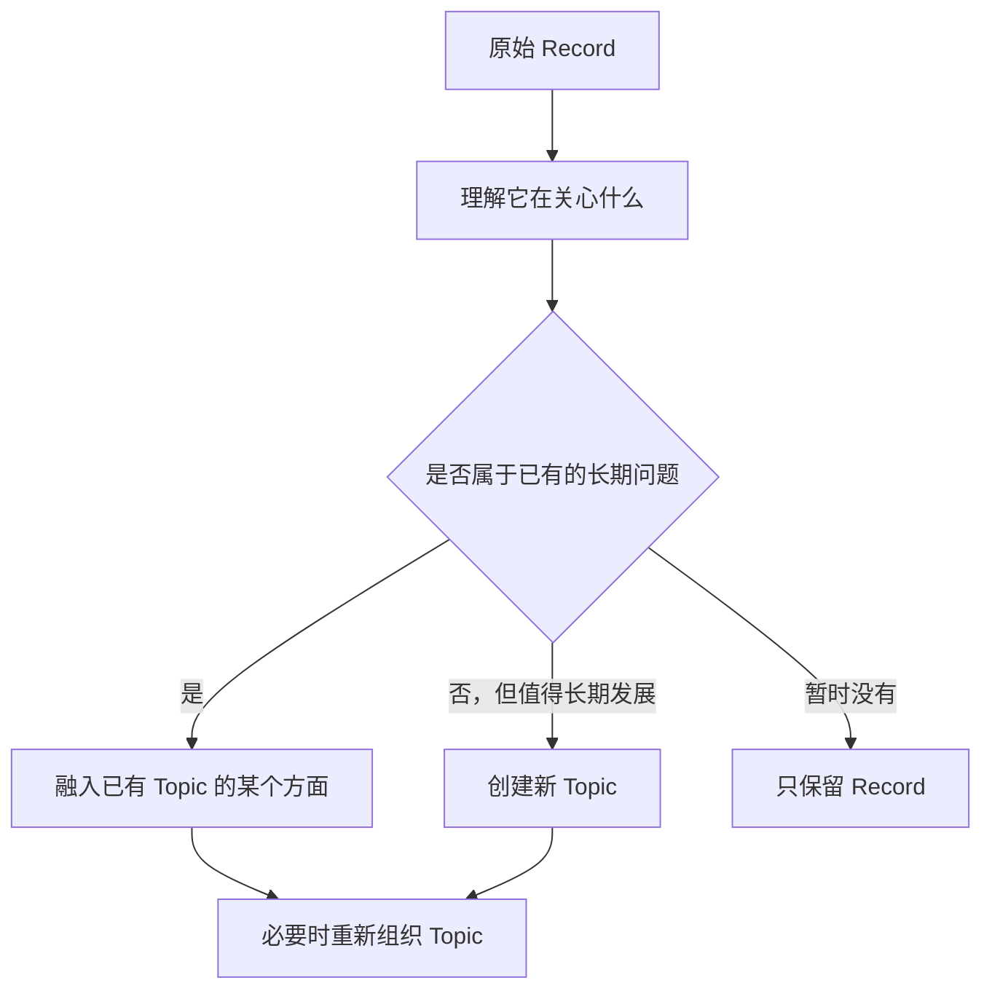

当前版本完成了“把 Record 写成结构化文章”，但还没有实现“让碎片自然沉淀为长期 Topic”。核心问题不只是相关性判断不准，而是系统把 **Record 中的一个观点误当成了一个 Topic**。

## 一、当前效果评估

整体结论：**基础链路可运行，但核心产品价值尚未验证成功。**

| 维度 | 当前表现 | 评价 |
|---|---|---|
| 原始记录保留 | Record 完整保存 | 良好 |
| 内容理解 | 基本能理解每条 Record 的字面含义 | 尚可 |
| Topic 生成 | 几乎每种观点都生成独立 Topic | 较差 |
| Topic 粒度 | 标题接近单条观点或文章标题 | 过细 |
| 相关内容聚合 | 只识别直接语义相近，缺少上层问题识别 | 较差 |
| Topic 内容 | 结构完整，但扩写、复述和套话较多 | 一般 |
| 增量价值 | 主要是把用户的话“写长” | 偏低 |
| 长期生长能力 | 新 Record 不断产生新 Topic | 尚未成立 |

目前更像：

```text
一条 Record
→ 提炼一个观点
→ 围绕观点写一篇小文章
→ 创建一个 Topic
```

理想链路应该是：



关键差异是：

> Record 是一次表达，Topic 是一个可以容纳许多表达、长期反复进入的思考空间。

---

## 二、这批数据更合理的整理结果

这 6 条 Record，当前生成了 5 个 Topic。按照你的使用目标，更合理的是先形成 **2 个 Topic**。

### Topic 1：AI Native 工程师的能力与协作实践

包含：

- `ff98a617...`：AI 能理解但不一定严格执行
- `9da8cdf3...`：先澄清方案、确认上下文和根因
- `25b095f2...`：技术文档可视化、git worktree 隔离
- `9fbfb0c9...`：工程师核心能力从写代码转向驾驭 AI 工作流

这些 Record 的表层内容不同：

- 一个谈模型执行偏差；
- 一个谈协作方法；
- 一个谈工程实践；
- 一个谈职业能力变化。

但它们服务于同一个长期问题：

> 在 AI Native 时代，我应该如何与 AI 可靠协作，并形成新的工程能力？

因此它们应该成为同一个 Topic 下的不同方面，而不是四个独立主题：

```markdown
# AI Native 工程师的能力与协作实践

## 当前判断

工程师的差异化能力正在从亲自完成大量编码，转向定义问题、
组织上下文、设计可靠工作流以及判断和验收 AI 的结果。

## AI 执行偏差

- 能理解指令，不代表会严格执行。
- 长上下文会稀释约束。
- 模型可能自行选择更省事的降级方案。

## 更可靠的协作方式

- 执行前将方案澄清到可直接操作。
- 让 Agent 主动指出不清楚的地方。
- 修复问题前先确认根因。
- 以当前项目状态作为权威上下文。

## 工程保障

- 用简洁的 Mermaid 图表达数据流和依赖关系。
- 使用 git worktree 隔离每次迭代。
- 将版本恢复建立在 git 上，而不是依赖 Agent 平台。

## 对个人能力发展的影响

真正需要积累的可能不只是编码技巧，而是：

1. 定义值得解决的问题；
2. 把模糊需求变成可靠流程；
3. 判断 AI 应该做什么、不应该做什么；
4. 验证结果并对最终交付负责。

## 尚未解决的问题

- 哪些约束应该进入长期项目上下文？
- 怎样验证 AI 没有偷偷降低方案要求？
- 哪些环节适合自动化，哪些必须由人判断？
```

这时每条 Record 是 Topic 的一块新材料，而不是一个新 Topic。

### Topic 2：Eiko 的碎片沉淀机制

包含：

- `761b5eef...`：重点不是分类，而是自然形成长期话题
- `470f30ad...`：错误合并比暂时不合并更糟

它们共同回答的是：

> Eiko 应该怎样把零散记录沉淀为长期话题？

“保守合并”并不是另一个长期 Topic，而是这个产品问题下的一条设计原则。

```markdown
# Eiko 的碎片沉淀机制

## 产品目标

用户只负责表达，系统负责让零散表达逐渐获得联系、形状和意义。

重点不是自动分类，而是在不增加整理负担的前提下，让长期关心的问题自然浮现。

## 当前原则

### 不要求每条记录都形成 Topic

有些记录暂时只需要被完整保留。没有形成 Topic，不代表它没有价值。

### Topic 应当是长期问题，而不是单条观点

一条 Record 中提炼出的结论，可以成为 Topic 的一个部分，但不应自然升级为独立 Topic。

### 合并需要克制

错误合并会破坏用户对内容的理解，因此系统需要谨慎判断。

但“保守”不等于“每条记录单独建 Topic”。当多条记录明显服务于同一个长期问题时，应当把它们组织为同一 Topic 的不同方面。

## 当前需要验证的问题

- 怎样识别两条表面不同、实际服务于同一问题的 Record？
- Topic 应该保持多大的范围？
- 什么时候只保留 Record，什么时候创建新 Topic？
- Topic 内容如何随着新记录重组，而不是无限追加？
```

---

## 三、真正的问题：Topic 的定义不清楚

当前模型实际上把 Topic 理解成了：

> 从一条 Record 中提炼出的、可以独立成文的观点。

这必然导致 Topic 爆炸，因为任何有意义的 Record 都能扩写成一篇文章。

建议重新定义为：

> **Topic 是用户在较长时间内可能反复进入的一个问题、方向、关系、项目或生命处境。它为多次相关思考提供共同上下文。**

Topic 不是：

- 一个关键词分类；
- 一条结论；
- 一篇自动生成的文章；
- 一条 Record 的扩写；
- 一个为了保持整洁而建立的文件夹。

判断 Topic 粒度时，最有效的问题不是“内容是否相似”，而是：

> 用户未来再次谈到这条 Record 时，是否希望 Eiko 带着同一份上下文继续讨论？

如果答案是“是”，通常就应该进入同一个 Topic。

---

# 四、碎片知识整理的方法论

## 1. 从“语义分类”转向“长期关切识别”

传统知识整理关注：

> 这条内容属于哪个类别？

Eiko 应该关注：

> 这条内容正在推进用户的哪个长期关切？

“AI Coding”“git”“Mermaid”“工程师竞争力”在关键词上并不完全相同，但都可能推进同一个长期关切：

> 我如何成为一个更成熟的 AI Native 工程师？

相反，两条都包含“AI”的记录，也未必属于同一 Topic：

- 如何与 AI 协作完成软件开发；
- 如何设计 Eiko 的商业模式。

它们共享关键词，却不共享未来的使用上下文。

因此，相关性不能主要依赖：

- 关键词重合；
- 标签相似；
- 标题相似；
- 单句语义相似。

而应该判断：

- 是否围绕同一个对象；
- 是否服务于同一个长期问题；
- 是否影响同一组决策；
- 是否会在同一种场景下被重新使用；
- 新 Record 是否能够推进 Topic，而不只是与它“有关”。

---

## 2. 区分四个认知层级

不一定需要把它们全部设计成数据库实体，但模型必须在思考中区分。

| 层级 | 含义 | 当前案例 |
|---|---|---|
| Record | 用户某个时刻的原始表达 | “长上下文中约束会被稀释” |
| Point | Record 中可提取的观点、事实、疑问或行动 | “理解不等于严格执行” |
| Facet | Topic 内部相对稳定的一个方面 | “AI 的执行偏差” |
| Topic | 可以长期承载多个方面的上下文 | “AI Native 工程师的能力与协作实践” |

当前系统的问题，是跳过了中间层：

```text
Record → Point → 直接创建 Topic
```

正确方式是：

```text
Record → Point → 判断属于哪个 Facet → 推进 Topic
```

`Point` 和 `Facet` 首版不必单独建表，可以只是模型更新 Markdown 时使用的内部概念。

---

## 3. Topic 应围绕“长期问题”，而不是“当前结论”

当前标题：

> AI Coding 的执行偏差：能理解不等于会严格执行

这是一个明确结论，范围天然很窄。后续只有再次讨论执行偏差时才容易合并进来。

更好的标题：

> AI Native 工程师的能力与协作实践

它能够容纳：

- 模型执行偏差；
- Prompt 和上下文管理；
- Agent 工作流；
- git 实践；
- 方案设计；
- 验收机制；
- 工程师职业能力变化。

Topic 标题应该满足：

- 六个月后仍可能继续使用；
- 可以容纳多个相关但不同的观点；
- 不依赖某一条 Record 才成立；
- 用户看到标题后，知道自己会在什么情况下再次进入它。

但也不能宽泛成：

- AI
- 工作
- 产品思考
- 人生
- 技术

这些只是分类，不是可生长的思考上下文。

---

## 4. 创建 Topic 应该有门槛

一条 Record 有价值，不代表它必须形成 Topic。

建议只有同时满足以下条件时才创建：

1. 包含相对独立的问题、方向、项目或持续处境；
2. 预计未来还会出现相关记录或继续讨论；
3. 无法自然进入已有 Topic；
4. 当前内容足以描述这个 Topic 的基本边界。

否则：

- 可以更新已有 Topic；
- 也可以仅保留 Record；
- 等未来出现更多相关 Record 后再创建。

这意味着系统必须接受：

> 一条 Record 已经完成处理，但没有对应 Topic。

这不是失败，而是健康状态。

---

## 5. 合并依据不是“像不像”，而是“能否共同推进”

建议使用“共同推进测试”。

对于 Record 和一个已有 Topic，依次问：

### 对象是否一致

它们是否在讨论同一个项目、关系、能力方向、生活问题或决策对象？

### 核心问题是否一致

即使表面内容不同，它们是否在回答同一个更上层的问题？

### 使用场景是否一致

用户未来会不会在同一次阅读、思考或决策中同时需要它们？

### 新内容能否改变 Topic

Record 能否为 Topic 增加以下至少一种东西：

- 新事实；
- 新观点；
- 新方法；
- 新行动；
- 新问题；
- 对旧结论的修正；
- 对用户状态的新理解。

如果只是关键词相似，却不能推进 Topic，就不应合并。

---

## 6. Topic 内部通过 Facet 吸收差异

为了避免“合并后变得混乱”，系统不应依赖拆分 Topic 来保持结构，而应在 Topic 内部形成自然分面。

例如：

```text
AI Native 工程师的能力与协作实践
├── 核心能力变化
├── AI 执行偏差
├── 上下文与约束
├── 方案澄清
├── 版本隔离与回滚
└── 验收和反馈闭环
```

这些是正文结构，不需要成为子 Topic，也不需要增加复杂的领域模型。

这样可以同时避免：

- 每条观点一个 Topic；
- 所有内容挤成一段文字；
- 为了结构化而引入复杂的父子 Topic。

---

## 7. 整理不是追加，而是重新理解

新 Record 进入 Topic 后，不应简单执行：

```text
在正文末尾增加一节
```

而应该先判断它对原有 Topic 的影响：

| 影响类型 | 处理方式 |
|---|---|
| 补充 | 放进已有方面，增强原判断 |
| 展开 | 新增一个 Facet |
| 修正 | 修改已有结论，保留必要的不确定性 |
| 冲突 | 同时呈现两种判断及矛盾 |
| 行动 | 更新适合尝试的下一步 |
| 例证 | 作为具体经验支撑观点 |
| 无增量 | 不修改 Topic |

每次更新后的 Topic 应该更清晰，而不是单纯更长。

当正文开始重复或结构混乱时，再整体重组。

---

## 8. 区分“用户说的”和“Eiko 推出的”

当前内容存在一定程度的过度扩写。

例如：

> 错误合并的代价是不可逆的。

这个判断并不准确，因为原始 Record 仍被保留，错误合并在技术上可以修正。用户表达的是“错误合并造成的认知污染更糟”，模型将其扩写成了“不可逆”。

又如：

> 85% 的机械性操作自动化。

这是用户记录中的判断，不应直接写成客观事实。更合适的是：

> 用户当前判断：AI-Native 工作流可能帮助自己自动化大量机械操作；“85%”是一个有待实际验证的目标值。

Topic 内容应该区分：

- 用户明确表达的判断；
- Eiko 基于上下文作出的推断；
- 可以验证的客观事实；
- 仍需探索的问题。

否则 Topic 看似完整，实际上会悄悄放大未经验证的假设。

---

## 9. 需要两种整理尺度

只处理单条 Record，无法彻底避免 Topic 分裂。因为系统在每次局部判断时，都可能认为当前内容值得新建 Topic。

因此需要两种思考尺度。

### 局部整理

每次处理新 Record：

- 理解内容；
- 尽量进入已有 Topic；
- 必要时创建 Topic；
- 可以暂时不沉淀。

### 全局整理

处理完一批 Record 后，重新观察全部 Topic：

- 哪些 Topic 实际属于同一个长期关切；
- 哪些 Topic 只是另一个 Topic 的 Facet；
- 哪些 Topic 长期没有生长价值；
- 哪些标题过窄；
- 哪些正文出现重复或矛盾；
- 是否需要合并、改名或重组。

你现在遇到的问题，不能只靠优化单条 Record 的匹配 Prompt 解决。系统缺少的正是一次 **全局视角的 Topic 重整**。

---

# 五、适合 Eiko 的整理原则

可以归纳为六条：

1. **原始 Record 永远保留，整理结果可以变化。**
2. **不是每条 Record 都需要形成 Topic。**
3. **Topic 表达长期关切，不表达单条观点。**
4. **内容是否属于同一 Topic，取决于它们是否共享未来上下文。**
5. **不同观点优先成为 Topic 内部的 Facet，而不是新 Topic。**
6. **局部吸收新记录，全局定期重新审视 Topic 边界。**

其中第 3 条是当前最关键的修正：

> 不要问“这条 Record 能生成什么 Topic”，而要问“它正在推进用户的哪个长期问题”。

---

## 六、对 MVP 的最终判断

这轮测试是有意义的，因为它已经暴露出最核心的问题：

> 模型擅长把一条记录扩写成一篇看似完整的内容，但这并不等于完成了个人思考的长期整理。

因此，当前不应该继续优化文字质量或 Markdown 模板。下一步应该优先验证：

1. 能否识别 Record 背后的上层长期关切；
2. 能否把不同子观点收进同一个 Topic；
3. 能否接受“这条记录暂时不形成 Topic”；
4. 能否定期发现并合并过细的 Topic；
5. 合并后的 Topic 是否比多个独立小文章更值得用户重新阅读。

如果按照这套方法重新整理当前数据，**5 个 Topic 应收敛为 2 个 Topic**。这会是判断下一版逻辑是否真正改善的最直观标准。